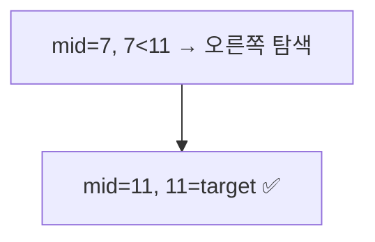
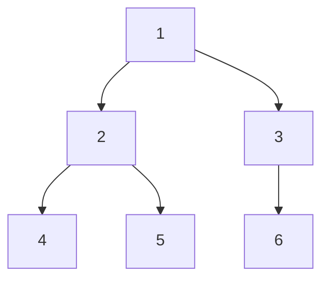
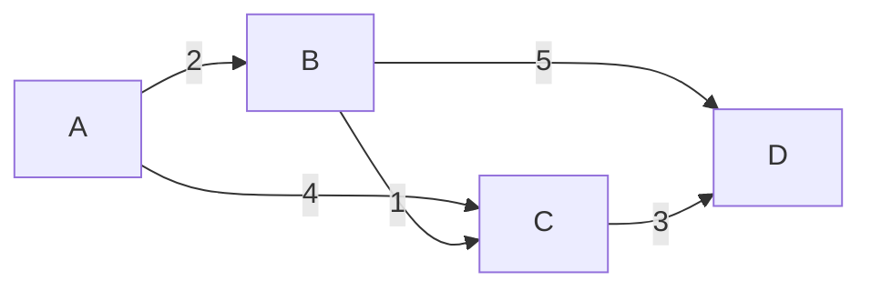
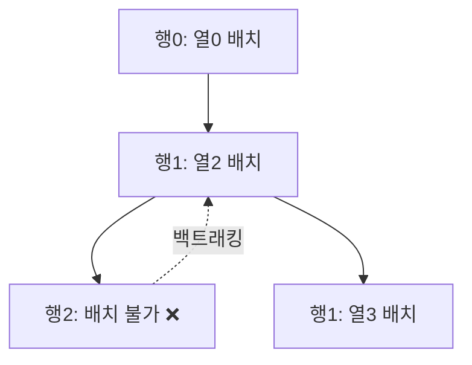

# search-algorithms

# 🔍 탐색(Search) 알고리즘 완전 정복 — 코딩테스트 대비 노트

기본 → 중간 → 심화 순으로 원리, 시각 자료, JavaScript 코드를 정리했습니다.
각 알고리즘은 **왜 쓰는지 / 어떻게 동작하는지 / 시간복잡도 / 코드 / 코딩테스트 활용 팁** 순으로 구성했습니다.

---

## 목차

| 단계 | 알고리즘 |
|---|---|
| 기본 | 1. 순차 탐색 (Linear Search) |
| 기본 | 2. 이진 탐색 (Binary Search) |
| 중간 | 3. 너비 우선 탐색 (BFS) |
| 중간 | 4. 깊이 우선 탐색 (DFS) |
| 중간 | 5. 해시 기반 탐색 (Hash Search) |
| 심화 | 6. 다익스트라 최단 경로 (Dijkstra) |
| 심화 | 7. A* 탐색 알고리즘 |
| 심화 | 8. 유니온-파인드 (Union-Find) |
| 심화 | 9. 백트래킹 (Backtracking) |

---

# 🟢 기본 단계

## 1. 순차 탐색 (Linear Search)

### 원리
배열의 처음부터 끝까지 하나씩 확인하며 원하는 값을 찾는 가장 단순한 탐색법입니다.
정렬 여부와 상관없이 사용할 수 있지만, 데이터가 많아지면 비효율적입니다.

### 시각 자료
```
[ 5, 3, 8, 1, 9, 2 ]  target = 9

step1: 5 ≠ 9  →
step2: 3 ≠ 9  →
step3: 8 ≠ 9  →
step4: 1 ≠ 9  →
step5: 9 = 9  ✅ found at index 4
```

### 시간복잡도
- 최선: O(1) (첫 번째 원소가 정답)
- 평균/최악: O(n)

### JavaScript 코드
```javascript
function linearSearch(arr, target) {
  for (let i = 0; i < arr.length; i++) {
    if (arr[i] === target) return i; // 찾은 인덱스 반환
  }
  return -1; // 못 찾음
}

// 예시
console.log(linearSearch([5, 3, 8, 1, 9, 2], 9)); // 4
```

### 코딩테스트 팁
- 데이터 개수가 적거나(N ≤ 1,000) 정렬이 안 된 배열이면 그냥 순차 탐색으로 충분한 경우가 많습니다.
- `Array.prototype.indexOf`, `includes`, `find`도 내부적으로 순차 탐색입니다.

---

## 2. 이진 탐색 (Binary Search)

### 원리
**정렬된 배열**에서 중간값과 비교해 탐색 범위를 절반씩 줄여나가는 방법입니다.
"매 순간 탐색 범위를 반으로 나눈다"는 점에서 분할 정복(Divide and Conquer) 알고리즘의 대표 예시입니다.

### 시각 자료
```
[1, 3, 5, 7, 9, 11, 13]   target = 11

left=0, right=6, mid=3 → arr[3]=7  → 7 < 11 → 오른쪽 탐색
left=4, right=6, mid=5 → arr[5]=11 → ✅ found at index 5
```



### 시간복잡도
- O(log n) — 데이터가 100만 개여도 약 20번 비교면 끝!

### JavaScript 코드
```javascript
function binarySearch(arr, target) {
  let left = 0;
  let right = arr.length - 1;

  while (left <= right) {
    const mid = Math.floor((left + right) / 2);

    if (arr[mid] === target) return mid;
    else if (arr[mid] < target) left = mid + 1;
    else right = mid - 1;
  }
  return -1;
}

console.log(binarySearch([1, 3, 5, 7, 9, 11, 13], 11)); // 5
```

### 재귀 버전
```javascript
function binarySearchRecursive(arr, target, left = 0, right = arr.length - 1) {
  if (left > right) return -1;

  const mid = Math.floor((left + right) / 2);
  if (arr[mid] === target) return mid;
  if (arr[mid] < target) return binarySearchRecursive(arr, target, mid + 1, right);
  return binarySearchRecursive(arr, target, left, mid - 1);
}
```

### 코딩테스트 팁
- **전제 조건: 배열이 정렬되어 있어야 함.** 정렬 안 된 배열이면 먼저 `sort()` 필요.
- "특정 조건을 만족하는 최소/최대값 찾기" 유형(파라메트릭 서치)의 기반이 됩니다 → 심화 단계에서 응용.
- `left + right`가 오버플로우 나는 언어도 있지만 JS는 숫자 범위가 커서 크게 문제되지 않음.

---

# 🟡 중간 단계

## 3. 너비 우선 탐색 (BFS, Breadth-First Search)

### 원리
그래프/트리에서 **가까운 노드부터** 순서대로 탐색하는 방법입니다.
큐(Queue)를 사용하여 "먼저 들어온 노드를 먼저 방문"하는 FIFO 방식으로 동작합니다.
**최단 경로(가중치 없는 그래프)** 를 구할 때 자주 사용됩니다.

### 시각 자료
```
그래프:
    1
   / \
  2   3
 / \   \
4   5   6

BFS 방문 순서: 1 → 2 → 3 → 4 → 5 → 6  (레벨 순서대로!)
```



### 시간복잡도
- O(V + E) (V: 노드 수, E: 간선 수)

### JavaScript 코드
```javascript
function bfs(graph, start) {
  const visited = new Set([start]);
  const queue = [start];
  const order = [];

  while (queue.length > 0) {
    const node = queue.shift(); // 큐의 맨 앞을 꺼냄
    order.push(node);

    for (const neighbor of graph[node]) {
      if (!visited.has(neighbor)) {
        visited.add(neighbor);
        queue.push(neighbor);
      }
    }
  }
  return order;
}

const graph = {
  1: [2, 3],
  2: [1, 4, 5],
  3: [1, 6],
  4: [2],
  5: [2],
  6: [3],
};

console.log(bfs(graph, 1)); // [1, 2, 3, 4, 5, 6]
```

> ⚠️ `Array.shift()`는 O(n)이라 데이터가 많으면 느려집니다. 코딩테스트에서는 실제 큐 자료구조(포인터 인덱스 방식)를 직접 구현하는 것이 안전합니다.

```javascript
// 성능 개선 버전 (포인터 방식 큐)
function bfsOptimized(graph, start) {
  const visited = new Set([start]);
  const queue = [start];
  let head = 0;
  const order = [];

  while (head < queue.length) {
    const node = queue[head++];
    order.push(node);
    for (const neighbor of graph[node]) {
      if (!visited.has(neighbor)) {
        visited.add(neighbor);
        queue.push(neighbor);
      }
    }
  }
  return order;
}
```

### 코딩테스트 팁
- "최단 거리", "최소 이동 횟수" 문제는 BFS가 정답인 경우가 많습니다 (미로 찾기, 게임판 이동 등).
- 방문 체크(`visited`)를 큐에 넣는 시점에 하는 것이 중복 방문을 막는 핵심 포인트입니다.

---

## 4. 깊이 우선 탐색 (DFS, Depth-First Search)

### 원리
한 방향으로 **끝까지 파고든 뒤** 막히면 되돌아오는(백트래킹) 탐색 방법입니다.
스택(재귀 호출 스택 포함) 구조를 사용합니다.

### 시각 자료
```
    1
   / \
  2   3
 / \   \
4   5   6

DFS 방문 순서: 1 → 2 → 4 → 5 → 3 → 6  (한 갈래를 끝까지!)
```

### 시간복잡도
- O(V + E)

### JavaScript 코드 (재귀)
```javascript
function dfsRecursive(graph, node, visited = new Set(), order = []) {
  visited.add(node);
  order.push(node);

  for (const neighbor of graph[node]) {
    if (!visited.has(neighbor)) {
      dfsRecursive(graph, neighbor, visited, order);
    }
  }
  return order;
}

console.log(dfsRecursive(graph, 1)); // [1, 2, 4, 5, 3, 6]
```

### JavaScript 코드 (반복문 + 스택)
```javascript
function dfsIterative(graph, start) {
  const visited = new Set();
  const stack = [start];
  const order = [];

  while (stack.length > 0) {
    const node = stack.pop();
    if (visited.has(node)) continue;

    visited.add(node);
    order.push(node);

    // 방문 순서를 유지하려면 자식들을 역순으로 push
    for (let i = graph[node].length - 1; i >= 0; i--) {
      const neighbor = graph[node][i];
      if (!visited.has(neighbor)) stack.push(neighbor);
    }
  }
  return order;
}
```

### BFS vs DFS 비교

| 구분 | BFS | DFS |
|---|---|---|
| 자료구조 | 큐 | 스택/재귀 |
| 탐색 방식 | 레벨(가까운 순) | 한 갈래 끝까지 |
| 최단 경로 | ✅ 유리 (가중치 없을 때) | ❌ 보장 안 됨 |
| 메모리 | 넓게 퍼질 때 불리 | 깊이 깊을 때 불리 |
| 대표 문제 | 최단거리, 레벨별 탐색 | 경로 존재 여부, 백트래킹, 사이클 탐지 |

### 코딩테스트 팁
- 재귀 DFS는 깊이가 매우 깊으면(수만 이상) 스택 오버플로우 위험 → 반복문 버전 고려.
- "연결 요소 개수", "섬의 개수" 같은 문제는 DFS/BFS 둘 다 무방합니다.

---

## 5. 해시 기반 탐색 (Hash-based Search)

### 원리
값을 해시 함수로 변환해 특정 위치(버킷)에 저장하면, 탐색 시 **평균 O(1)** 로 값을 찾을 수 있습니다.
JS에서는 `Map`, `Set`, `Object`가 내부적으로 해시 테이블을 사용합니다.

### 시각 자료
```
key "apple" → hash(apple) = 3 → bucket[3]에 저장
key "banana" → hash(banana) = 7 → bucket[7]에 저장

탐색 시: hash("apple") 계산 → 바로 bucket[3] 확인 → O(1)
```

### 시간복잡도
- 평균: O(1)
- 최악(해시 충돌 심할 때): O(n)

### JavaScript 코드
```javascript
// Map을 활용한 빠른 탐색 예시: 두 수의 합(Two Sum)
function twoSum(nums, target) {
  const map = new Map(); // 값 -> 인덱스

  for (let i = 0; i < nums.length; i++) {
    const complement = target - nums[i];
    if (map.has(complement)) {
      return [map.get(complement), i];
    }
    map.set(nums[i], i);
  }
  return [];
}

console.log(twoSum([2, 7, 11, 15], 9)); // [0, 1]
```

### 직접 구현해보는 간단한 해시 테이블
```javascript
class SimpleHashMap {
  constructor(size = 16) {
    this.buckets = Array.from({ length: size }, () => []);
    this.size = size;
  }

  _hash(key) {
    let hash = 0;
    for (const char of String(key)) {
      hash = (hash * 31 + char.charCodeAt(0)) % this.size;
    }
    return hash;
  }

  set(key, value) {
    const idx = this._hash(key);
    const bucket = this.buckets[idx];
    const existing = bucket.find((pair) => pair[0] === key);
    if (existing) existing[1] = value;
    else bucket.push([key, value]);
  }

  get(key) {
    const idx = this._hash(key);
    const found = this.buckets[idx].find((pair) => pair[0] === key);
    return found ? found[1] : undefined;
  }
}

const hm = new SimpleHashMap();
hm.set("apple", 100);
console.log(hm.get("apple")); // 100
```

### 코딩테스트 팁
- "중복 확인", "빈도수 계산", "짝(pair) 찾기" 문제는 거의 항상 `Map`/`Set`으로 O(n)에 해결 가능합니다.
- 배열을 순회하며 `includes()`로 매번 확인하면 O(n²)이 되니, Set/Map으로 O(n)으로 줄이는 습관이 중요합니다.

---

# 🔴 심화 단계

## 6. 다익스트라 최단 경로 (Dijkstra's Algorithm)

### 원리
**가중치가 있는** 그래프에서 한 시작점으로부터 모든 노드까지의 최단 거리를 구하는 알고리즘입니다.
"현재까지 가장 가까운 노드"를 우선순위 큐(최소 힙)로 꺼내며 거리를 갱신(완화, relaxation)해 나갑니다.

### 시각 자료
```
     (2)      (5)
  A -----> B -----> D
  |         ^        ^
  |(4)      |(1)     |(3)
  v         |         |
  C --------+---------+

시작점 A에서:
dist[A]=0, dist[B]=2, dist[C]=4
B를 거쳐 C 갱신: dist[C] = min(4, 2+1) = 3
D 갱신: dist[D] = min(∞, 2+5, 3+3) = 6
```



### 시간복잡도
- 우선순위 큐 사용 시: O((V + E) log V)

### JavaScript 코드
```javascript
class MinHeap {
  constructor() { this.heap = []; }
  push(item) {
    this.heap.push(item);
    this._bubbleUp(this.heap.length - 1);
  }
  pop() {
    const top = this.heap[0];
    const last = this.heap.pop();
    if (this.heap.length > 0) {
      this.heap[0] = last;
      this._bubbleDown(0);
    }
    return top;
  }
  get size() { return this.heap.length; }

  _bubbleUp(i) {
    while (i > 0) {
      const parent = Math.floor((i - 1) / 2);
      if (this.heap[parent][0] <= this.heap[i][0]) break;
      [this.heap[parent], this.heap[i]] = [this.heap[i], this.heap[parent]];
      i = parent;
    }
  }
  _bubbleDown(i) {
    const n = this.heap.length;
    while (true) {
      let smallest = i;
      const left = 2 * i + 1, right = 2 * i + 2;
      if (left < n && this.heap[left][0] < this.heap[smallest][0]) smallest = left;
      if (right < n && this.heap[right][0] < this.heap[smallest][0]) smallest = right;
      if (smallest === i) break;
      [this.heap[smallest], this.heap[i]] = [this.heap[i], this.heap[smallest]];
      i = smallest;
    }
  }
}

function dijkstra(graph, start) {
  // graph: { A: [[B, 2], [C, 4]], B: [[C, 1], [D, 5]], ... }
  const dist = {};
  for (const node in graph) dist[node] = Infinity;
  dist[start] = 0;

  const pq = new MinHeap();
  pq.push([0, start]); // [거리, 노드]

  while (pq.size > 0) {
    const [d, node] = pq.pop();
    if (d > dist[node]) continue; // 이미 더 짧은 경로로 갱신된 노드는 skip

    for (const [neighbor, weight] of graph[node]) {
      const newDist = d + weight;
      if (newDist < dist[neighbor]) {
        dist[neighbor] = newDist;
        pq.push([newDist, neighbor]);
      }
    }
  }
  return dist;
}

const weightedGraph = {
  A: [["B", 2], ["C", 4]],
  B: [["C", 1], ["D", 5]],
  C: [["D", 3]],
  D: [],
};

console.log(dijkstra(weightedGraph, "A"));
// { A: 0, B: 2, C: 3, D: 6 }
```

### 코딩테스트 팁
- **음수 가중치가 있으면 다익스트라는 틀린 답을 낼 수 있습니다** → 이 경우 벨만-포드(Bellman-Ford) 사용.
- 우선순위 큐 없이 O(V²)로 구현할 수도 있지만, 노드 수가 많으면(V > 1000) 반드시 힙 사용.

---

## 7. A* 탐색 알고리즘

### 원리
다익스트라에 **"목표까지의 예상 거리(휴리스틱, heuristic)"** 를 더해 탐색 방향을 목표 쪽으로 유도하는 알고리즘입니다.

```
f(n) = g(n) + h(n)

g(n): 시작점부터 현재 노드까지의 실제 비용
h(n): 현재 노드부터 목표까지의 "예상" 비용 (휴리스틱)
```

다익스트라는 "모든 방향"을 고르게 탐색하지만, A*는 목표 방향으로 **더 똑똑하게** 탐색해서 더 빠릅니다.

### 시각 자료 (격자 맵에서의 경로 탐색)
```
S: 시작, G: 목표, #: 장애물

S . . . .
. # # # .
. . . # .
# # . # .
. . . . G

A*는 맨해튼 거리(|dx| + |dy|) 같은 휴리스틱으로
"G에 가까워지는 방향"을 우선적으로 탐색합니다.
```

### 시간복잡도
- 최악의 경우 다익스트라와 같은 O(E log V)지만, 휴리스틱이 좋으면 훨씬 빠릅니다.

### JavaScript 코드 (격자 맵 예시)
```javascript
function heuristic(a, b) {
  // 맨해튼 거리
  return Math.abs(a[0] - b[0]) + Math.abs(a[1] - b[1]);
}

function aStar(grid, start, goal) {
  const rows = grid.length, cols = grid[0].length;
  const key = ([r, c]) => `${r},${c}`;

  const gScore = { [key(start)]: 0 };
  const fScore = { [key(start)]: heuristic(start, goal) };
  const cameFrom = {};

  const openSet = new MinHeap();
  openSet.push([fScore[key(start)], start]);
  const inOpen = new Set([key(start)]);

  const directions = [[1,0],[-1,0],[0,1],[0,-1]];

  while (openSet.size > 0) {
    const [, current] = openSet.pop();
    inOpen.delete(key(current));

    if (key(current) === key(goal)) {
      // 경로 역추적
      const path = [current];
      let cur = key(current);
      while (cameFrom[cur]) {
        path.unshift(cameFrom[cur]);
        cur = key(cameFrom[cur]);
      }
      return path;
    }

    for (const [dr, dc] of directions) {
      const next = [current[0] + dr, current[1] + dc];
      const [nr, nc] = next;
      if (nr < 0 || nr >= rows || nc < 0 || nc >= cols) continue;
      if (grid[nr][nc] === 1) continue; // 장애물

      const tentativeG = gScore[key(current)] + 1;
      if (tentativeG < (gScore[key(next)] ?? Infinity)) {
        cameFrom[key(next)] = current;
        gScore[key(next)] = tentativeG;
        fScore[key(next)] = tentativeG + heuristic(next, goal);
        if (!inOpen.has(key(next))) {
          openSet.push([fScore[key(next)], next]);
          inOpen.add(key(next));
        }
      }
    }
  }
  return null; // 경로 없음
}

// 0: 이동 가능, 1: 장애물
const grid = [
  [0,0,0,0,0],
  [0,1,1,1,0],
  [0,0,0,1,0],
  [1,1,0,1,0],
  [0,0,0,0,0],
];

console.log(aStar(grid, [0,0], [4,4]));
```

### 코딩테스트 팁
- 코딩테스트에서 A*가 직접 요구되는 경우는 드물지만, **휴리스틱 개념 자체**(추정치로 탐색 순서를 정하는 발상)는 다양한 그리디/우선순위 큐 문제에 응용됩니다.
- 휴리스틱이 실제 거리보다 항상 작거나 같아야(admissible) 최단 경로가 보장됩니다.

---

## 8. 유니온-파인드 (Union-Find / Disjoint Set)

### 원리
여러 노드들을 그룹(집합)으로 묶고, "두 노드가 같은 그룹인지" 매우 빠르게 확인하는 자료구조입니다.
- `find(x)`: x가 속한 그룹의 대표(root)를 찾음
- `union(x, y)`: x와 y가 속한 그룹을 합침

**경로 압축(Path Compression)** + **랭크에 의한 합치기(Union by Rank)** 를 함께 쓰면 거의 O(1)에 가까운 성능이 나옵니다.

### 시각 자료
```
초기 상태: 1  2  3  4  5   (모두 자기 자신이 root)

union(1, 2) → 1과 2는 같은 그룹
union(3, 4) → 3과 4는 같은 그룹

    1        3
    |        |
    2        4      5 (혼자)

find(2) → 1 (root)
find(4) → 3 (root)
union(2, 4) → 그룹 {1,2}와 {3,4}를 합침
```

### 시간복잡도
- 최적화 시 거의 O(α(n)) ≈ O(1) (α: 아커만 함수의 역함수, 사실상 상수)

### JavaScript 코드
```javascript
class UnionFind {
  constructor(n) {
    this.parent = Array.from({ length: n }, (_, i) => i);
    this.rank = new Array(n).fill(0);
  }

  find(x) {
    if (this.parent[x] !== x) {
      this.parent[x] = this.find(this.parent[x]); // 경로 압축
    }
    return this.parent[x];
  }

  union(x, y) {
    const rootX = this.find(x);
    const rootY = this.find(y);
    if (rootX === rootY) return false; // 이미 같은 그룹

    // 랭크가 낮은 트리를 높은 트리 밑에 붙임
    if (this.rank[rootX] < this.rank[rootY]) {
      this.parent[rootX] = rootY;
    } else if (this.rank[rootX] > this.rank[rootY]) {
      this.parent[rootY] = rootX;
    } else {
      this.parent[rootY] = rootX;
      this.rank[rootX]++;
    }
    return true;
  }

  isConnected(x, y) {
    return this.find(x) === this.find(y);
  }
}

const uf = new UnionFind(5); // 노드 0~4
uf.union(0, 1);
uf.union(2, 3);
console.log(uf.isConnected(0, 1)); // true
console.log(uf.isConnected(0, 2)); // false
uf.union(1, 2);
console.log(uf.isConnected(0, 3)); // true
```

### 코딩테스트 팁
- "네트워크 연결 여부", "친구 관계", "사이클 판별", **크루스칼(Kruskal) 최소 신장 트리** 알고리즘의 핵심 부품입니다.
- 경로 압축을 빼먹으면 최악의 경우 O(n)까지 느려질 수 있으니 꼭 구현하세요.

---

## 9. 백트래킹 (Backtracking)

### 원리
가능한 모든 경우를 탐색하되, **"이 방향은 답이 될 수 없다"** 는 게 확실해지는 순간 즉시 되돌아가서(가지치기, pruning) 탐색 범위를 줄이는 기법입니다.
DFS의 응용이라고 볼 수 있습니다.

### 시각 자료 (N-Queen, N=4 예시)
```
4x4 보드에 서로 공격하지 않게 퀸 4개를 놓는 문제

행 0: Q 후보 열 탐색 → 열 0에 놓아봄
행 1: 열 0,1은 공격받음 → 열 2에 놓아봄
행 2: 모든 열이 공격받음 → ❌ 되돌아감(백트래킹)
행 1: 다른 열 시도... (반복)

즉, "안 되는 걸 확인하면 바로 포기하고 이전 단계로 복귀"
```



### 시간복잡도
- 최악의 경우 지수 시간(O(N!) 수준)이지만, 가지치기로 실제 탐색량은 크게 줄어듦

### JavaScript 코드 (N-Queen)
```javascript
function solveNQueens(n) {
  const results = [];
  const cols = new Set();
  const diag1 = new Set(); // row - col
  const diag2 = new Set(); // row + col
  const placement = [];

  function backtrack(row) {
    if (row === n) {
      results.push([...placement]);
      return;
    }

    for (let col = 0; col < n; col++) {
      if (cols.has(col) || diag1.has(row - col) || diag2.has(row + col)) {
        continue; // 이 열은 놓을 수 없음 → 가지치기
      }

      // 선택
      cols.add(col);
      diag1.add(row - col);
      diag2.add(row + col);
      placement.push(col);

      backtrack(row + 1);

      // 선택 취소 (백트래킹의 핵심!)
      cols.delete(col);
      diag1.delete(row - col);
      diag2.delete(row + col);
      placement.pop();
    }
  }

  backtrack(0);
  return results;
}

console.log(solveNQueens(4));
// [[1, 3, 0, 2], [2, 0, 3, 1]]  → 2가지 해법
```

### JavaScript 코드 (조합/부분집합 - 더 일반적인 코딩테스트 유형)
```javascript
// 배열에서 합이 target이 되는 모든 조합 찾기
function combinationSum(candidates, target) {
  const results = [];
  const current = [];

  function backtrack(start, remain) {
    if (remain === 0) {
      results.push([...current]);
      return;
    }
    if (remain < 0) return; // 가지치기: 더 진행할 필요 없음

    for (let i = start; i < candidates.length; i++) {
      current.push(candidates[i]);
      backtrack(i, remain - candidates[i]); // 같은 수 재사용 가능
      current.pop(); // 백트래킹
    }
  }

  backtrack(0, target);
  return results;
}

console.log(combinationSum([2, 3, 6, 7], 7));
// [[2,2,3], [7]]
```

### 코딩테스트 팁
- "모든 경우의 수", "순열/조합", "부분집합" 문제의 기본 템플릿: **선택 → 재귀 → 선택 취소(복구)**.
- 가지치기 조건을 최대한 일찍 걸어야 성능이 좋아집니다 (예: `remain < 0`이면 바로 return).

---

## 📌 전체 요약 표

| 알고리즘 | 시간복잡도 | 주요 활용 |
|---|---|---|
| 순차 탐색 | O(n) | 작은 데이터, 정렬 불필요 |
| 이진 탐색 | O(log n) | 정렬된 배열, 파라메트릭 서치 |
| BFS | O(V+E) | 최단 거리(무가중치), 레벨 탐색 |
| DFS | O(V+E) | 경로 존재, 백트래킹, 사이클 탐지 |
| 해시 탐색 | O(1) 평균 | 중복 체크, 빈도수, 짝 찾기 |
| 다익스트라 | O((V+E)logV) | 가중치 최단 경로 (음수 없음) |
| A* | 상황에 따라 다름 | 목표 지향 경로 탐색 |
| 유니온-파인드 | O(α(n)) ≈ O(1) | 그룹 판별, 크루스칼 MST |
| 백트래킹 | O(지수) + 가지치기 | 순열/조합, N-Queen, 부분집합 |

## 🎯 학습 순서 추천
1. 기본 단계는 눈으로만 봐도 이해가 갈 수 있지만, 직접 손코딩으로 3번 이상 짜보세요.
2. 중간 단계(BFS/DFS)는 그래프를 인접 리스트로 표현하는 연습을 충분히 하세요. 이 부분이 익숙해지면 이후 알고리즘이 훨씬 쉬워집니다.
3. 심화 단계는 각 알고리즘의 "왜 이렇게 동작해야 하는가"를 먼저 이해한 뒤 코드를 암기하기보다 구조를 이해하는 것이 응용문제 대응에 유리합니다.
