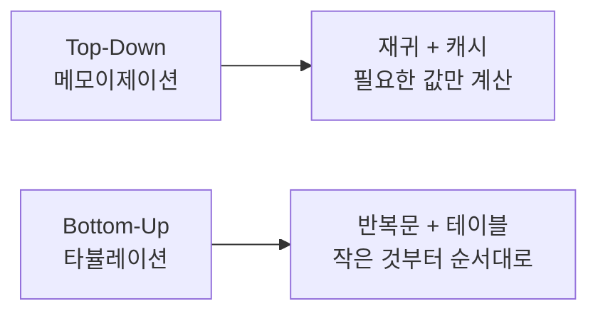
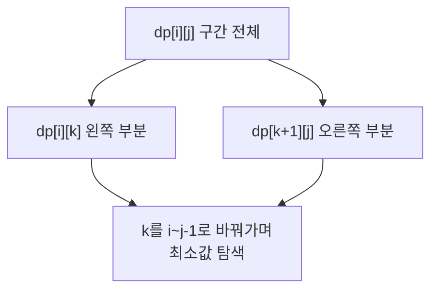
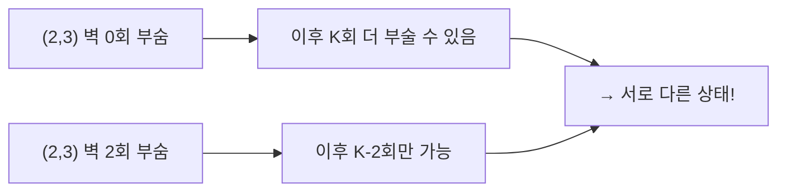

# 🧠 동적 계획법(DP) 심화 & 기업 유형별 대비 노트

앞선 **탐색 / 트리 / 자료구조** 노트에 이어, 이번엔 난이도가 한 단계 높은 **동적 계획법(DP)** 과 그 주변 알고리즘을 정리합니다.
후반부에는 **삼성전자·네이버랩스 스타일 문제의 접근법과 학습 우선순위**를 별도로 다룹니다.

---

## 목차

### Part 1. 동적 계획법 (DP)
| 단계 | 주제 |
|---|---|
| 기본 | 1. DP의 원리 — 메모이제이션 vs 타뷸레이션 |
| 기본 | 2. 1차원 DP — 피보나치·계단 오르기·집 털기 |
| 중간 | 3. 배낭 문제 (Knapsack) — 0/1과 무한 |
| 중간 | 4. 2차원 DP — LCS, 편집 거리 |
| 중간 | 5. LIS (최장 증가 부분 수열) — O(n²)와 O(n log n) |
| 심화 | 6. 비트마스크 DP (외판원 문제, TSP) |
| 심화 | 7. 구간 DP (행렬 곱셈 순서) |
| 심화 | 8. 트리 DP |

### Part 2. 기업 유형별 대비 전략
| 항목 |
|---|
| 9. 삼성전자 역량테스트 유형 — 시뮬레이션 & 완전탐색 |
| 10. 네이버랩스 유형 — 그래프·경로 탐색·최적화 |
| 11. 실전 체크리스트 & 학습 우선순위 |

---

# Part 1. 동적 계획법 (Dynamic Programming)

## 1. DP의 원리 — 메모이제이션 vs 타뷸레이션

### 왜 DP를 쓰는가?
같은 부분 문제를 **여러 번 반복 계산**하는 구조라면, 한 번 계산한 결과를 저장해두고 재사용해서 지수 시간을 다항 시간으로 줄이는 기법입니다.

DP가 성립하려면 두 가지 조건이 필요합니다.

1. **최적 부분 구조 (Optimal Substructure)**: 큰 문제의 답이 작은 문제의 답으로 구성됨
2. **중복되는 부분 문제 (Overlapping Subproblems)**: 같은 작은 문제가 반복해서 등장함

> 💡 조건 2가 없다면 그냥 분할 정복(예: 병합 정렬)입니다. "겹치는가?"가 DP를 쓸지 판단하는 핵심 기준입니다.

### 시각 자료 — 피보나치의 중복 계산
```
재귀만 사용 (O(2ⁿ)):

                fib(5)
              /        \
         fib(4)        fib(3)
        /     \        /    \
    fib(3)  fib(2)  fib(2) fib(1)
    /   \
 fib(2) fib(1)        ← fib(3)이 2번, fib(2)가 3번 중복 계산됨!

DP 사용 (O(n)):
fib(2)를 처음 계산할 때 저장 → 이후엔 O(1)로 꺼내 씀
```

### 두 가지 구현 방식



| 구분 | 메모이제이션 (Top-Down) | 타뷸레이션 (Bottom-Up) |
|---|---|---|
| 방식 | 재귀 + 캐시 | 반복문 + 배열 |
| 장점 | 점화식 그대로 옮기기 쉬움, 필요한 값만 계산 | 스택 오버플로우 없음, 상수 시간 빠름 |
| 단점 | 재귀 깊이 제한 위험 | 모든 상태를 계산해야 함 |
| 언제 | 상태 공간이 크고 일부만 필요할 때 | 모든 상태가 필요하고 n이 클 때 |

### JavaScript 코드
```javascript
// 방식 1: 메모이제이션 (Top-Down)
function fibMemo(n, memo = {}) {
  if (n <= 1) return n;
  if (memo[n] !== undefined) return memo[n]; // 이미 계산한 값 재사용

  memo[n] = fibMemo(n - 1, memo) + fibMemo(n - 2, memo);
  return memo[n];
}

// 방식 2: 타뷸레이션 (Bottom-Up)
function fibTab(n) {
  if (n <= 1) return n;
  const dp = new Array(n + 1);
  dp[0] = 0;
  dp[1] = 1;
  for (let i = 2; i <= n; i++) {
    dp[i] = dp[i - 1] + dp[i - 2];
  }
  return dp[n];
}

// 방식 3: 공간 최적화 (O(1) 공간)
// dp[i]는 직전 두 값만 필요하므로 배열 전체를 유지할 이유가 없음
function fibOptimized(n) {
  if (n <= 1) return n;
  let prev2 = 0, prev1 = 1;
  for (let i = 2; i <= n; i++) {
    [prev2, prev1] = [prev1, prev1 + prev2];
  }
  return prev1;
}

console.log(fibMemo(40));      // 102334155
console.log(fibOptimized(40)); // 102334155
```

### 시간복잡도
- 단순 재귀: O(2ⁿ) → DP 적용: **O(n)**
- 공간: 타뷸레이션 O(n) → 슬라이딩 최적화 시 **O(1)**

### 핵심 사고 흐름 (DP 문제 푸는 4단계)
```
1. 상태 정의:   dp[i]가 "무엇"을 의미하는가?
2. 점화식 도출: dp[i]를 dp[i-1], dp[i-2]... 로 어떻게 표현하는가?
3. 초기값 설정: dp[0], dp[1]은 무엇인가?
4. 순회 방향:   어떤 순서로 채워야 의존하는 값이 먼저 채워지는가?
```
이 4단계를 **반드시 코드 작성 전에 종이에 적는 습관**을 들이세요. 실전에서 DP 문제를 틀리는 대부분의 원인은 코드 실수가 아니라 1번(상태 정의)이 잘못된 것입니다.

---

## 2. 1차원 DP — 계단 오르기 / 집 털기

### 원리
가장 단순한 형태의 DP입니다. `dp[i]`가 "i번째까지 고려했을 때의 최적값"을 의미합니다.

### 시각 자료 — 집 털기 (인접한 집은 못 털 때)
```
집: [2, 7, 9, 3, 1]

dp[i] = max(dp[i-1],          ← i번째 집을 안 털고 넘어감
            dp[i-2] + nums[i]) ← i번째 집을 털고, i-1은 건너뜀

i=0: dp[0] = 2
i=1: dp[1] = max(2, 7) = 7
i=2: dp[2] = max(7, 2+9) = 11
i=3: dp[3] = max(11, 7+3) = 11
i=4: dp[4] = max(11, 11+1) = 12  ✅ 정답
```

### JavaScript 코드
```javascript
// 계단 오르기: 한 번에 1칸 또는 2칸씩, n칸을 오르는 방법의 수
function climbStairs(n) {
  if (n <= 2) return n;
  const dp = new Array(n + 1);
  dp[1] = 1;
  dp[2] = 2;
  for (let i = 3; i <= n; i++) {
    dp[i] = dp[i - 1] + dp[i - 2]; // 1칸 남은 상태 + 2칸 남은 상태
  }
  return dp[n];
}

// 집 털기: 인접한 집은 털 수 없을 때 최대 금액
function rob(nums) {
  if (nums.length === 0) return 0;
  if (nums.length === 1) return nums[0];

  let prev2 = nums[0];
  let prev1 = Math.max(nums[0], nums[1]);

  for (let i = 2; i < nums.length; i++) {
    const current = Math.max(prev1, prev2 + nums[i]);
    prev2 = prev1;
    prev1 = current;
  }
  return prev1;
}

console.log(climbStairs(5));        // 8
console.log(rob([2, 7, 9, 3, 1]));  // 12
```

### 코딩테스트 팁
- `dp[i]`가 직전 1~2개 값만 참조한다면 **배열 없이 변수 2~3개로 공간을 O(1)로 줄일 수 있습니다.** 면접에서 "더 최적화할 수 있나요?"라는 질문의 단골 답변입니다.

---

## 3. 배낭 문제 (Knapsack)

### 원리
무게 제한이 있는 배낭에 물건을 담아 **가치의 합을 최대화**하는 문제입니다. DP의 대표 유형으로, 수많은 문제가 이 형태로 변형되어 출제됩니다.

- **0/1 배낭**: 각 물건을 **최대 한 번**만 담을 수 있음
- **무한 배낭 (Unbounded)**: 같은 물건을 **여러 번** 담을 수 있음

### 시각 자료 — 0/1 배낭
```
물건: (무게, 가치) = [(1,15), (3,20), (4,30)]
배낭 용량: 4

dp[i][w] = i번째 물건까지 고려, 용량 w일 때의 최대 가치

        w=0  w=1  w=2  w=3  w=4
i=0(없음) 0    0    0    0    0
i=1(1,15) 0   15   15   15   15
i=2(3,20) 0   15   15   20   35   ← 1번+2번 = 15+20 = 35
i=3(4,30) 0   15   15   20   35   ← 3번(무게4,가치30) 단독보다 35가 더 큼

점화식:
  물건 i를 못 담는 경우(w < weight[i]): dp[i][w] = dp[i-1][w]
  담을 수 있는 경우: dp[i][w] = max(dp[i-1][w], dp[i-1][w-weight[i]] + value[i])
                                 ↑ 안 담음      ↑ 담음
```

### 시간복잡도
- O(N × W) (N: 물건 수, W: 배낭 용량)
- ⚠️ 용량 W가 매우 크면(10⁹ 등) 이 방식은 불가능합니다 → 다른 접근(그리디/분기한정) 필요

### JavaScript 코드
```javascript
// 0/1 배낭 (2차원 DP — 이해하기 쉬운 버전)
function knapsack01(weights, values, capacity) {
  const n = weights.length;
  const dp = Array.from({ length: n + 1 }, () => new Array(capacity + 1).fill(0));

  for (let i = 1; i <= n; i++) {
    for (let w = 0; w <= capacity; w++) {
      if (weights[i - 1] > w) {
        dp[i][w] = dp[i - 1][w]; // 못 담음
      } else {
        dp[i][w] = Math.max(
          dp[i - 1][w],                                  // 안 담기
          dp[i - 1][w - weights[i - 1]] + values[i - 1]   // 담기
        );
      }
    }
  }
  return dp[n][capacity];
}

// 0/1 배낭 (1차원 최적화 — 실전에서 더 자주 쓰임)
function knapsack01Optimized(weights, values, capacity) {
  const dp = new Array(capacity + 1).fill(0);

  for (let i = 0; i < weights.length; i++) {
    // ⚠️ 역순 순회가 핵심! 같은 물건을 중복으로 담는 걸 방지
    for (let w = capacity; w >= weights[i]; w--) {
      dp[w] = Math.max(dp[w], dp[w - weights[i]] + values[i]);
    }
  }
  return dp[capacity];
}

// 무한 배낭 (같은 물건 여러 번 가능) — 정순 순회
function knapsackUnbounded(weights, values, capacity) {
  const dp = new Array(capacity + 1).fill(0);

  for (let i = 0; i < weights.length; i++) {
    // ⚠️ 정순 순회 — 이미 갱신된 값을 다시 참조하므로 중복 사용이 허용됨
    for (let w = weights[i]; w <= capacity; w++) {
      dp[w] = Math.max(dp[w], dp[w - weights[i]] + values[i]);
    }
  }
  return dp[capacity];
}

console.log(knapsack01([1, 3, 4], [15, 20, 30], 4));          // 35
console.log(knapsack01Optimized([1, 3, 4], [15, 20, 30], 4)); // 35
console.log(knapsackUnbounded([1, 3, 4], [15, 20, 30], 4));   // 60 (1번 물건 4개)
```

### 코딩테스트 팁
- **역순 vs 정순 순회의 차이**가 0/1과 무한 배낭을 가르는 유일한 차이점입니다. 이 한 줄 때문에 답이 달라지므로 반드시 이해하고 넘어가세요.
- "동전 교환", "부분집합 합", "목표 금액 만들기" 문제는 모두 배낭 문제의 변형입니다.

---

## 4. 2차원 DP — LCS와 편집 거리

### 원리
두 문자열/배열을 비교하는 문제는 `dp[i][j]`처럼 **두 인덱스를 상태로 갖는 2차원 테이블**로 풀립니다.

- **LCS (Longest Common Subsequence)**: 두 문자열의 최장 공통 부분 수열
- **편집 거리 (Edit Distance)**: 한 문자열을 다른 문자열로 바꾸는 최소 연산 횟수 (삽입/삭제/교체)

### 시각 자료 — LCS
```
문자열 A = "ABCBDAB", B = "BDCAB"
dp[i][j] = A의 앞 i글자와 B의 앞 j글자의 LCS 길이

        ""  B   D   C   A   B
    ""   0   0   0   0   0   0
    A    0   0   0   0   1   1
    B    0   1   1   1   1   2
    C    0   1   1   2   2   2
    B    0   1   1   2   2   3   ← 정답: 4 (전체 테이블 완성 시)

점화식:
  A[i] === B[j] → dp[i][j] = dp[i-1][j-1] + 1        (대각선 + 1)
  다르면        → dp[i][j] = max(dp[i-1][j], dp[i][j-1])  (위 또는 왼쪽 중 큰 값)
```

### 시간복잡도
- O(m × n) (두 문자열의 길이)

### JavaScript 코드
```javascript
// LCS: 최장 공통 부분 수열의 길이
function lcs(a, b) {
  const m = a.length, n = b.length;
  const dp = Array.from({ length: m + 1 }, () => new Array(n + 1).fill(0));

  for (let i = 1; i <= m; i++) {
    for (let j = 1; j <= n; j++) {
      if (a[i - 1] === b[j - 1]) {
        dp[i][j] = dp[i - 1][j - 1] + 1;
      } else {
        dp[i][j] = Math.max(dp[i - 1][j], dp[i][j - 1]);
      }
    }
  }
  return dp[m][n];
}

// LCS 문자열 자체를 복원하기 (역추적)
function lcsString(a, b) {
  const m = a.length, n = b.length;
  const dp = Array.from({ length: m + 1 }, () => new Array(n + 1).fill(0));

  for (let i = 1; i <= m; i++) {
    for (let j = 1; j <= n; j++) {
      dp[i][j] = a[i - 1] === b[j - 1]
        ? dp[i - 1][j - 1] + 1
        : Math.max(dp[i - 1][j], dp[i][j - 1]);
    }
  }

  // 테이블을 거꾸로 따라가며 실제 문자열 복원
  let result = "";
  let i = m, j = n;
  while (i > 0 && j > 0) {
    if (a[i - 1] === b[j - 1]) {
      result = a[i - 1] + result;
      i--; j--;
    } else if (dp[i - 1][j] >= dp[i][j - 1]) {
      i--;
    } else {
      j--;
    }
  }
  return result;
}

// 편집 거리: word1을 word2로 바꾸는 최소 연산 수
function editDistance(word1, word2) {
  const m = word1.length, n = word2.length;
  const dp = Array.from({ length: m + 1 }, () => new Array(n + 1).fill(0));

  for (let i = 0; i <= m; i++) dp[i][0] = i; // word1을 전부 삭제
  for (let j = 0; j <= n; j++) dp[0][j] = j; // word2를 전부 삽입

  for (let i = 1; i <= m; i++) {
    for (let j = 1; j <= n; j++) {
      if (word1[i - 1] === word2[j - 1]) {
        dp[i][j] = dp[i - 1][j - 1]; // 같으면 연산 불필요
      } else {
        dp[i][j] = 1 + Math.min(
          dp[i - 1][j],     // 삭제
          dp[i][j - 1],     // 삽입
          dp[i - 1][j - 1]  // 교체
        );
      }
    }
  }
  return dp[m][n];
}

console.log(lcs("ABCBDAB", "BDCAB"));           // 4
console.log(lcsString("ABCBDAB", "BDCAB"));     // "BCAB"
console.log(editDistance("horse", "ros"));      // 3
```

### 코딩테스트 팁
- **"역추적(backtracking)으로 실제 답을 복원하라"** 는 요구가 자주 붙습니다. 테이블을 다 채운 뒤 거꾸로 따라가는 패턴을 익혀두세요.
- 2차원 DP도 `dp[i][j]`가 직전 행만 참조하면 두 개의 1차원 배열로 공간을 O(n)으로 줄일 수 있습니다.

---

## 5. LIS (최장 증가 부분 수열)

### 원리
수열에서 순서를 유지하면서 증가하는 가장 긴 부분 수열을 찾는 문제입니다.
**O(n²) 기본 DP 방식**과 **O(n log n) 이진 탐색 방식** 두 가지를 모두 알아야 합니다 (n이 10만 이상이면 후자가 필수).

### 시각 자료
```
배열: [10, 9, 2, 5, 3, 7, 101, 18]

[방법 1: O(n²) DP]
dp[i] = i번째를 마지막으로 하는 LIS의 길이

i:     0   1   2   3   4   5   6    7
nums: 10   9   2   5   3   7  101   18
dp:    1   1   1   2   2   3   4    4   ← 최댓값 4가 정답

[방법 2: O(n log n) — "길이별 최소 끝값" 배열 유지]
tails = 길이 k인 증가 수열의 "가장 작은 마지막 값"

10        → tails=[10]
9  (<10)  → 10을 9로 교체 → tails=[9]
2  (<9)   → tails=[2]
5  (>2)   → 추가        → tails=[2,5]
3  (2<3<5)→ 5를 3으로 교체 → tails=[2,3]   ← 길이는 그대로지만 더 유리해짐
7  (>3)   → 추가        → tails=[2,3,7]
101(>7)   → 추가        → tails=[2,3,7,101]
18 (<101) → 101을 18로 교체 → tails=[2,3,7,18]

tails의 길이 = 4 ✅
※ tails 배열 자체는 실제 LIS가 아님(길이만 정확함)에 주의!
```

### 시간복잡도
| 방식 | 복잡도 | 적용 기준 |
|---|---|---|
| DP | O(n²) | n ≤ 3,000 정도 |
| 이진 탐색 | O(n log n) | n이 10⁵ 이상 |

### JavaScript 코드
```javascript
// 방법 1: O(n²) DP
function lisDP(nums) {
  if (nums.length === 0) return 0;
  const dp = new Array(nums.length).fill(1);

  for (let i = 1; i < nums.length; i++) {
    for (let j = 0; j < i; j++) {
      if (nums[j] < nums[i]) {
        dp[i] = Math.max(dp[i], dp[j] + 1);
      }
    }
  }
  return Math.max(...dp);
}

// 방법 2: O(n log n) 이진 탐색
function lisBinarySearch(nums) {
  const tails = []; // tails[k] = 길이 k+1인 증가 수열의 최소 마지막 값

  for (const num of nums) {
    // num이 들어갈 위치를 이진 탐색 (lower bound)
    let left = 0, right = tails.length;
    while (left < right) {
      const mid = Math.floor((left + right) / 2);
      if (tails[mid] < num) left = mid + 1;
      else right = mid;
    }

    if (left === tails.length) tails.push(num); // 가장 크면 길이 증가
    else tails[left] = num;                     // 아니면 해당 위치를 더 작은 값으로 교체
  }
  return tails.length;
}

const nums = [10, 9, 2, 5, 3, 7, 101, 18];
console.log(lisDP(nums));            // 4
console.log(lisBinarySearch(nums));  // 4
```

### 코딩테스트 팁
- 입력 크기 N을 보고 어느 방식을 쓸지 먼저 판단하세요. N=100,000인데 O(n²)를 쓰면 100억 연산으로 시간 초과입니다.
- "가장 긴 감소 수열", "회의실 배정", "상자 쌓기" 같은 문제들이 LIS의 변형으로 출제됩니다.

---

## 6. 비트마스크 DP (외판원 문제, TSP)

### 원리
"방문한 도시들의 집합"처럼 **상태가 집합(subset)인 경우**, 이를 정수의 비트로 표현하면 DP 테이블의 인덱스로 쓸 수 있습니다.

```
방문 상태를 비트로: 도시 4개일 때
  0b0000 = 아무 곳도 방문 안 함
  0b0101 = 0번, 2번 도시 방문함
  0b1111 = 모두 방문함 (= 15)

→ 2ⁿ가지 상태를 정수 하나로 표현 가능!
```

### 시각 자료
```
TSP: 모든 도시를 한 번씩 방문하고 출발점으로 돌아오는 최소 비용

dp[visited][current] = "visited 집합을 방문했고 현재 current에 있을 때"
                        남은 도시를 모두 돌고 출발점으로 가는 최소 비용

    dp[0b0001][0]  ← 0번만 방문, 현재 0번 (시작 상태)
         ↓ 1번 도시로 이동
    dp[0b0011][1]
         ↓ 2번 도시로 이동
    dp[0b0111][2]
         ↓ ...
    dp[0b1111][k] → 모두 방문 → 출발점으로 복귀 비용 더하고 종료
```

### 자주 쓰는 비트 연산
| 연산 | 의미 |
|---|---|
| `visited & (1 << i)` | i번을 방문했는지 확인 (0이 아니면 방문함) |
| `visited \| (1 << i)` | i번을 방문 처리 |
| `visited & ~(1 << i)` | i번 방문 해제 |
| `(1 << n) - 1` | n개 모두 방문한 상태 (전체 집합) |

### 시간복잡도
- O(2ⁿ × n²) — 상태 2ⁿ × 현재 위치 n × 전이 n
- ⚠️ **N ≤ 20 정도까지만 가능**합니다 (2²⁰ ≈ 100만). N이 그보다 크면 DP가 아닌 근사/휴리스틱 접근이 필요합니다.

### JavaScript 코드
```javascript
function tsp(dist) {
  const n = dist.length;
  const FULL = (1 << n) - 1;
  const INF = Infinity;

  // dp[visited][current] = 최소 비용
  const dp = Array.from({ length: 1 << n }, () => new Array(n).fill(-1));

  function solve(visited, current) {
    // 모든 도시를 방문했으면 출발점(0)으로 복귀
    if (visited === FULL) {
      return dist[current][0] === 0 ? INF : dist[current][0];
    }

    if (dp[visited][current] !== -1) return dp[visited][current]; // 메모이제이션

    let best = INF;
    for (let next = 0; next < n; next++) {
      if (visited & (1 << next)) continue;      // 이미 방문함
      if (dist[current][next] === 0) continue;  // 길이 없음

      const cost = dist[current][next] + solve(visited | (1 << next), next);
      best = Math.min(best, cost);
    }

    dp[visited][current] = best;
    return best;
  }

  return solve(1, 0); // 0번 도시에서 출발 (0번만 방문한 상태)
}

// dist[i][j] = i에서 j로 가는 비용 (0이면 경로 없음)
const dist = [
  [0, 10, 15, 20],
  [5, 0, 9, 10],
  [6, 13, 0, 12],
  [8, 8, 9, 0],
];

console.log(tsp(dist)); // 35
```

### 코딩테스트 팁
- **문제에서 N이 15~20 사이로 작게 주어지면 비트마스크 DP를 의심하세요.** 출제자가 의도적으로 2ⁿ이 감당 가능한 범위로 제한한 신호입니다.
- 순회 경로 최적화, 작업 할당 문제, "모든 조건을 만족하는 조합 세기" 등에 활용됩니다.

---

## 7. 구간 DP (Interval DP)

### 원리
`dp[i][j]`가 **"구간 [i, j]를 처리했을 때의 최적값"** 을 의미하는 DP입니다.
구간을 작은 것부터 점점 넓혀가며 채우고, 중간 분할점 k를 순회하며 최적을 찾습니다.

### 시각 자료 — 행렬 곱셈 순서 최적화
```
행렬 A(10×30), B(30×5), C(5×60)을 곱할 때 연산 횟수를 최소화

(A×B)×C = 10*30*5 + 10*5*60  = 1500 + 3000 = 4500
A×(B×C) = 30*5*60 + 10*30*60 = 9000 + 18000 = 27000

→ 곱하는 "순서"에 따라 6배 차이!

dp[i][j] = i번째부터 j번째 행렬까지 곱하는 최소 연산 수

채우는 순서 (구간 길이를 2 → 3 → ... 로 늘려가며):
  len=2:  dp[0][1], dp[1][2]
  len=3:  dp[0][2]  ← 내부의 모든 분할점 k를 시도

  dp[i][j] = min over k ( dp[i][k] + dp[k+1][j] + 비용 )
```



### 시간복잡도
- O(n³) — 구간 시작 × 구간 끝 × 분할점

### JavaScript 코드
```javascript
// 행렬 곱셈 순서 최적화
// dims = [10, 30, 5, 60] → 행렬 A(10×30), B(30×5), C(5×60)
function matrixChainOrder(dims) {
  const n = dims.length - 1; // 행렬 개수
  const dp = Array.from({ length: n }, () => new Array(n).fill(0));

  // 구간 길이를 2부터 n까지 늘려감 (작은 구간부터 채워야 함)
  for (let len = 2; len <= n; len++) {
    for (let i = 0; i <= n - len; i++) {
      const j = i + len - 1;
      dp[i][j] = Infinity;

      // 분할점 k를 순회하며 최소 비용 탐색
      for (let k = i; k < j; k++) {
        const cost = dp[i][k] + dp[k + 1][j] + dims[i] * dims[k + 1] * dims[j + 1];
        dp[i][j] = Math.min(dp[i][j], cost);
      }
    }
  }
  return dp[0][n - 1];
}

console.log(matrixChainOrder([10, 30, 5, 60])); // 4500

// 응용: 팰린드롬 부분 문자열 개수 세기 (구간 DP의 다른 형태)
function countPalindromicSubstrings(s) {
  const n = s.length;
  const dp = Array.from({ length: n }, () => new Array(n).fill(false));
  let count = 0;

  for (let i = n - 1; i >= 0; i--) {       // 뒤에서부터 (i < j 의존성 때문)
    for (let j = i; j < n; j++) {
      if (s[i] === s[j] && (j - i < 2 || dp[i + 1][j - 1])) {
        dp[i][j] = true;
        count++;
      }
    }
  }
  return count;
}

console.log(countPalindromicSubstrings("aaa")); // 6
```

### 코딩테스트 팁
- **구간 DP의 핵심은 "순회 순서"입니다.** `dp[i][j]`가 `dp[i+1][j-1]`처럼 더 작은 구간에 의존하므로, 구간 길이 순으로 채우거나 i를 역순으로 순회해야 합니다. 이 순서를 틀리면 아직 계산 안 된 값을 참조하게 됩니다.
- "돌 합치기", "파일 합치기", "팰린드롬 분할" 등이 대표 유형입니다.

---

## 8. 트리 DP

### 원리
트리 구조 위에서 DP를 수행합니다. **자식 노드의 결과를 모아 부모 노드의 값을 계산**하는 방식이라, DFS(후위 순회)와 자연스럽게 결합됩니다.

### 시각 자료 — 트리에서 최대 독립 집합 (인접한 노드는 동시에 선택 불가)
```
        1(가중치 10)
       /            \
    2(5)           3(8)
   /    \
 4(3)   5(7)

dp[v][0] = v를 선택 안 했을 때, v 서브트리의 최대 합
dp[v][1] = v를 선택했을 때, v 서브트리의 최대 합

점화식:
  dp[v][0] = Σ max(dp[child][0], dp[child][1])   ← 자식은 자유롭게 선택
  dp[v][1] = weight[v] + Σ dp[child][0]          ← 자식은 반드시 미선택

계산 (리프부터 위로):
  dp[4] = [0, 3],  dp[5] = [0, 7],  dp[3] = [0, 8]
  dp[2][0] = max(0,3) + max(0,7) = 10
  dp[2][1] = 5 + 0 + 0 = 5
  dp[1][0] = max(10,5) + max(0,8) = 18
  dp[1][1] = 10 + 10 + 0 = 20  ✅ 정답 20
```

### 시간복잡도
- O(V + E) = O(n) — 각 노드를 한 번씩만 방문

### JavaScript 코드
```javascript
// 트리에서 최대 독립 집합 (인접 노드는 동시 선택 불가)
function treeMaxIndependentSet(n, edges, weights) {
  const graph = Array.from({ length: n }, () => []);
  for (const [u, v] of edges) {
    graph[u].push(v);
    graph[v].push(u);
  }

  // dp[v] = [v 미선택 시 최대, v 선택 시 최대]
  const dp = Array.from({ length: n }, () => [0, 0]);

  // 반복문 DFS (재귀 스택 오버플로우 방지 — 노드 수가 많을 때 중요)
  function dfs(root) {
    const stack = [[root, -1, false]];
    while (stack.length > 0) {
      const [node, parent, processed] = stack.pop();

      if (processed) {
        // 자식들이 모두 계산된 후 실행되는 부분 (후위 처리)
        dp[node][0] = 0;
        dp[node][1] = weights[node];
        for (const child of graph[node]) {
          if (child === parent) continue;
          dp[node][0] += Math.max(dp[child][0], dp[child][1]);
          dp[node][1] += dp[child][0];
        }
      } else {
        stack.push([node, parent, true]); // 자식 처리 후 돌아올 지점 예약
        for (const child of graph[node]) {
          if (child !== parent) stack.push([child, node, false]);
        }
      }
    }
  }

  dfs(0);
  return Math.max(dp[0][0], dp[0][1]);
}

const edges = [[0, 1], [0, 2], [1, 3], [1, 4]];
const weights = [10, 5, 8, 3, 7];
console.log(treeMaxIndependentSet(5, edges, weights)); // 20
```

### 코딩테스트 팁
- 트리 DP는 **"자식 → 부모" 방향으로 값이 올라간다**는 점만 이해하면 나머지는 일반 DP와 동일합니다. 후위 순회(post-order) 위치에서 계산한다는 것이 핵심입니다.
- 노드 수가 10만 개 이상이면 재귀 DFS가 스택 오버플로우를 일으킬 수 있으니, 위처럼 반복문 버전을 준비해두세요.

---

# Part 2. 기업 유형별 대비 전략

## 9. 삼성전자 역량테스트 유형 — 시뮬레이션 & 완전탐색

### 출제 경향의 핵심
삼성 SW 역량테스트(A형/B형)는 **화려한 알고리즘보다 "문제에 적힌 규칙을 정확히 구현하는 능력"** 을 봅니다.
문제 지문이 길고 규칙이 복잡하며, 대부분 다음 조합으로 구성됩니다.

```
[삼성 문제의 전형적 구조]

  2차원 격자(N×N, 보통 N ≤ 20)
        +
  복잡한 이동/변환 규칙 (지문에 상세히 명시)
        +
  "모든 경우를 다 해봐야 하는" 선택지 (완전탐색)
        +
  시간이 T번 흐르는 시뮬레이션
        ↓
  → 최댓값 / 최솟값 / 최종 상태 출력
```

### 대표 유형 5가지

| 유형 | 설명 | 대표 문제 |
|---|---|---|
| 격자 시뮬레이션 | 규칙대로 물체를 움직이고 상태를 갱신 | 상어 중학교, 마법사 상어와 파이어볼 |
| 회전/이동 연산 | 배열 회전, 밀기, 복사 | 톱니바퀴, 컨베이어 벨트 |
| 완전탐색 + 시뮬레이션 | 모든 선택 조합을 시도 후 최적값 | 사다리 조작, 연구소 (벽 세우기) |
| BFS + 시뮬레이션 | 시간 단위로 BFS 확산 | 아기 상어, 불! |
| 구현 난이도형 | 특별한 알고리즘 없이 순수 구현력 | 주사위 굴리기, 뱀 |

### 접근 전략 — 5단계 체크리스트

```
1️⃣ 지문을 "함수 단위"로 쪼개서 읽기
   "공을 이동시킨다" → moveBall()
   "같은 색을 제거한다" → removeGroup()
   "중력을 적용한다" → applyGravity()
   → 각 규칙을 독립 함수로 분리하면 디버깅이 10배 쉬워집니다.

2️⃣ 입력 크기(N)로 완전탐색 가능 여부 판단
   N ≤ 10   → O(N!) 순열 완전탐색 가능
   N ≤ 20   → O(2^N) 비트마스크 가능
   N ≤ 100  → O(N³) 가능
   N ≤ 1000 → O(N²) 가능
   ※ 삼성 문제는 대부분 N이 작습니다 = "완전탐색하라"는 신호

3️⃣ 상태 표현 방식 먼저 정하기
   보드를 어떻게 저장할지, 방향을 어떻게 나타낼지
   (dx/dy 배열 순서를 지문의 방향 번호와 반드시 일치시킬 것)

4️⃣ 한 턴(one step)을 완벽히 구현한 뒤, 반복문으로 감싸기
   → 한 턴이 맞으면 T번 반복도 맞습니다.

5️⃣ 깊은 복사 주의
   시뮬레이션 중 원본 배열을 백업할 때 얕은 복사는 버그의 온상입니다.
```

### 필수 코드 템플릿 (반드시 손에 익혀두세요)

```javascript
// ── 템플릿 1: 방향 배열 (지문 순서와 일치시킬 것!)
// 일반적으로 상, 하, 좌, 우 순서지만 문제마다 다르니 꼭 확인
const dx = [-1, 1, 0, 0];
const dy = [0, 0, -1, 1];

function inRange(x, y, n, m) {
  return x >= 0 && x < n && y >= 0 && y < m;
}

// ── 템플릿 2: 2차원 배열 깊은 복사 (시뮬레이션 백업용)
function deepCopy(board) {
  return board.map((row) => [...row]);
}

// ── 템플릿 3: 배열 90도 시계방향 회전 (톱니/블록 회전 문제 단골)
function rotate90(matrix) {
  const n = matrix.length, m = matrix[0].length;
  const result = Array.from({ length: m }, () => new Array(n).fill(0));
  for (let i = 0; i < n; i++) {
    for (let j = 0; j < m; j++) {
      result[j][n - 1 - i] = matrix[i][j];
    }
  }
  return result;
}

// ── 템플릿 4: 순열 생성 (모든 순서를 시도해야 할 때)
function permutations(arr) {
  if (arr.length <= 1) return [arr];
  const result = [];
  for (let i = 0; i < arr.length; i++) {
    const rest = [...arr.slice(0, i), ...arr.slice(i + 1)];
    for (const perm of permutations(rest)) {
      result.push([arr[i], ...perm]);
    }
  }
  return result;
}

// ── 템플릿 5: 조합 생성 (M개를 고르는 모든 경우)
function combinations(arr, m) {
  const result = [];
  function backtrack(start, current) {
    if (current.length === m) {
      result.push([...current]);
      return;
    }
    for (let i = start; i < arr.length; i++) {
      current.push(arr[i]);
      backtrack(i + 1, current);
      current.pop();
    }
  }
  backtrack(0, []);
  return result;
}

// ── 템플릿 6: 중복 순열 (각 칸에 K가지 선택지가 있을 때)
function productChoices(n, choices) {
  const result = [];
  function backtrack(depth, current) {
    if (depth === n) {
      result.push([...current]);
      return;
    }
    for (const c of choices) {
      current.push(c);
      backtrack(depth + 1, current);
      current.pop();
    }
  }
  backtrack(0, []);
  return result;
}
```

### 실전 예시 — "연구소" 스타일 문제 (완전탐색 + BFS 조합)

```javascript
/**
 * 문제: N×M 격자에서 빈 칸(0) 중 3곳에 벽을 세워
 *       바이러스(2)가 퍼지지 못하는 안전 영역을 최대화하라.
 *
 * 접근: 벽 3개를 놓는 모든 조합(완전탐색) × 각 경우마다 BFS로 확산 시뮬레이션
 */
function maxSafeArea(board) {
  const n = board.length, m = board[0].length;
  const dx = [-1, 1, 0, 0], dy = [0, 0, -1, 1];

  // 빈 칸과 바이러스 위치 수집
  const empties = [], viruses = [];
  for (let i = 0; i < n; i++) {
    for (let j = 0; j < m; j++) {
      if (board[i][j] === 0) empties.push([i, j]);
      if (board[i][j] === 2) viruses.push([i, j]);
    }
  }

  // 바이러스 확산 후 안전 영역 계산 (BFS)
  function simulate(walls) {
    const temp = board.map((row) => [...row]); // 깊은 복사 필수!
    for (const [x, y] of walls) temp[x][y] = 1;

    const queue = [...viruses];
    let head = 0;
    while (head < queue.length) {
      const [x, y] = queue[head++];
      for (let d = 0; d < 4; d++) {
        const nx = x + dx[d], ny = y + dy[d];
        if (nx < 0 || nx >= n || ny < 0 || ny >= m) continue;
        if (temp[nx][ny] !== 0) continue;
        temp[nx][ny] = 2;
        queue.push([nx, ny]);
      }
    }

    let safe = 0;
    for (let i = 0; i < n; i++) {
      for (let j = 0; j < m; j++) if (temp[i][j] === 0) safe++;
    }
    return safe;
  }

  // 빈 칸 중 3개를 고르는 모든 조합을 시도
  let answer = 0;
  for (let a = 0; a < empties.length; a++) {
    for (let b = a + 1; b < empties.length; b++) {
      for (let c = b + 1; c < empties.length; c++) {
        answer = Math.max(answer, simulate([empties[a], empties[b], empties[c]]));
      }
    }
  }
  return answer;
}

const lab = [
  [0, 0, 0, 0, 0, 0],
  [1, 0, 0, 0, 0, 2],
  [1, 1, 1, 0, 0, 2],
  [0, 0, 0, 0, 0, 2],
];
console.log(maxSafeArea(lab));
```

### 중점 학습 포인트 (삼성)
1. **구현 속도**: 알고리즘 선택은 쉽지만 코드량이 많습니다. 손이 느리면 시간 내에 못 끝냅니다 → 위 템플릿들을 반사적으로 칠 수 있을 정도로 연습
2. **디버깅 습관**: 격자 상태를 매 턴 출력해보는 함수를 미리 만들어두면 실전에서 큰 무기가 됩니다
3. **예외 처리**: 경계 조건, 동시에 여러 개가 움직이는 경우의 처리 순서(순차 vs 동시)를 지문에서 꼼꼼히 확인

---

## 10. 네이버랩스 유형 — 그래프·경로 탐색·최적화

### 출제 경향의 핵심
네이버랩스는 자율주행·로보틱스·지도/위치 기술을 다루는 조직 특성상, **공간 데이터와 경로 탐색, 최적화** 계열의 문제 비중이 상대적으로 높습니다. 일반적인 IT 대기업 코딩테스트 범위에 더해 다음 영역을 함께 준비하는 것이 좋습니다.

```
[네이버랩스 계열에서 자주 다루는 영역]

  그래프 최단 경로 (다익스트라, A*)
        +
  격자/공간 위의 경로 계획 (장애물 회피, 다중 목적지)
        +
  최적화 (여러 제약 조건 하에서 비용 최소화)
        +
  자료구조 설계 (효율적인 조회/갱신 구조)
```

### 중점 학습 리스트

| 우선순위 | 주제 | 왜 중요한가 |
|---|---|---|
| ★★★ | 다익스트라 + 우선순위 큐 | 가중치 있는 경로 탐색의 기본기 |
| ★★★ | BFS 변형 (0-1 BFS, 다중 시작점 BFS) | 격자 경로 문제의 핵심 |
| ★★★ | A* 휴리스틱 탐색 | 목표 지향 경로 계획의 표준 |
| ★★☆ | 상태 공간 BFS/DP | "위치 + 부가 상태"를 함께 관리 |
| ★★☆ | 최소 신장 트리 (크루스칼/프림) | 네트워크 연결 비용 최소화 |
| ★★☆ | 플로이드-워셜 | 모든 쌍 최단 경로 (노드 적을 때) |
| ★☆☆ | 위상 정렬 | 작업 순서·의존성 처리 |

### 핵심 기법 1: 상태 공간 탐색 (위치 + α)

가장 자주 나오면서도 많이 놓치는 유형입니다. **"현재 위치"만으로는 부족하고 추가 상태가 필요한 경우**입니다.

```
예: "벽을 K번까지 부수고 이동할 수 있을 때 최단 경로"

일반 BFS:   visited[x][y]           ← 잘못된 접근!
상태 BFS:   visited[x][y][부순횟수]  ← 올바른 접근

같은 (x,y)라도 "벽을 0번 부수고 도착"과 "2번 부수고 도착"은
이후 가능성이 완전히 다르므로 별개의 상태로 취급해야 합니다.
```



```javascript
/**
 * 벽을 K번까지 부수며 (0,0)에서 (n-1,m-1)까지 최단 거리
 * board: 0=빈칸, 1=벽
 */
function shortestPathWithBreaks(board, k) {
  const n = board.length, m = board[0].length;
  const dx = [-1, 1, 0, 0], dy = [0, 0, -1, 1];

  // ⭐ 3차원 방문 배열: [행][열][부순 횟수]
  const visited = Array.from({ length: n }, () =>
    Array.from({ length: m }, () => new Array(k + 1).fill(false))
  );

  const queue = [[0, 0, 0, 1]]; // [x, y, 부순횟수, 거리]
  let head = 0;
  visited[0][0][0] = true;

  while (head < queue.length) {
    const [x, y, broken, dist] = queue[head++];

    if (x === n - 1 && y === m - 1) return dist; // 도착

    for (let d = 0; d < 4; d++) {
      const nx = x + dx[d], ny = y + dy[d];
      if (nx < 0 || nx >= n || ny < 0 || ny >= m) continue;

      if (board[nx][ny] === 0 && !visited[nx][ny][broken]) {
        // 빈 칸: 그냥 이동
        visited[nx][ny][broken] = true;
        queue.push([nx, ny, broken, dist + 1]);
      } else if (board[nx][ny] === 1 && broken < k && !visited[nx][ny][broken + 1]) {
        // 벽: 부수고 이동 (부순 횟수 증가 = 다른 상태로 진입)
        visited[nx][ny][broken + 1] = true;
        queue.push([nx, ny, broken + 1, dist + 1]);
      }
    }
  }
  return -1; // 도달 불가
}

const maze = [
  [0, 1, 0, 0],
  [0, 1, 0, 1],
  [0, 0, 0, 1],
  [1, 1, 0, 0],
];
console.log(shortestPathWithBreaks(maze, 1)); // 7
```

### 핵심 기법 2: 0-1 BFS (가중치가 0 또는 1일 때)

간선 비용이 0 또는 1뿐이라면, 다익스트라의 우선순위 큐 대신 **덱(Deque)** 을 써서 O(V+E)에 해결할 수 있습니다.

```
원리:
  비용 0인 간선 → 덱의 앞(front)에 추가  ← 우선 처리
  비용 1인 간선 → 덱의 뒤(rear)에 추가

→ 자연스럽게 "비용이 낮은 순서"로 처리됨
→ log n 비용 없이 다익스트라와 같은 결과!
```

```javascript
// 0-1 BFS: 빈 칸(0) 이동은 비용 0, 벽(1) 통과는 비용 1
function zeroOneBFS(board) {
  const n = board.length, m = board[0].length;
  const dx = [-1, 1, 0, 0], dy = [0, 0, -1, 1];

  const dist = Array.from({ length: n }, () => new Array(m).fill(Infinity));
  dist[0][0] = 0;

  const deque = [[0, 0]];

  while (deque.length > 0) {
    const [x, y] = deque.shift();

    for (let d = 0; d < 4; d++) {
      const nx = x + dx[d], ny = y + dy[d];
      if (nx < 0 || nx >= n || ny < 0 || ny >= m) continue;

      const cost = board[nx][ny]; // 0 또는 1
      if (dist[x][y] + cost < dist[nx][ny]) {
        dist[nx][ny] = dist[x][y] + cost;
        // ⭐ 비용 0이면 앞에, 1이면 뒤에
        if (cost === 0) deque.unshift([nx, ny]);
        else deque.push([nx, ny]);
      }
    }
  }
  return dist[n - 1][m - 1];
}
```

### 핵심 기법 3: 다중 시작점 BFS

여러 지점에서 동시에 퍼져나가는 경우, **모든 시작점을 처음부터 큐에 넣고 시작**하면 한 번의 BFS로 해결됩니다. 시작점마다 따로 BFS를 돌리는 O(K×V)를 O(V)로 줄이는 핵심 기법입니다.

```javascript
// 각 칸에서 가장 가까운 "안전 지점"까지의 거리 구하기
function multiSourceBFS(board, sources) {
  const n = board.length, m = board[0].length;
  const dx = [-1, 1, 0, 0], dy = [0, 0, -1, 1];

  const dist = Array.from({ length: n }, () => new Array(m).fill(-1));
  const queue = [];
  let head = 0;

  // ⭐ 모든 시작점을 한꺼번에 큐에 넣고 시작
  for (const [x, y] of sources) {
    dist[x][y] = 0;
    queue.push([x, y]);
  }

  while (head < queue.length) {
    const [x, y] = queue[head++];
    for (let d = 0; d < 4; d++) {
      const nx = x + dx[d], ny = y + dy[d];
      if (nx < 0 || nx >= n || ny < 0 || ny >= m) continue;
      if (dist[nx][ny] !== -1 || board[nx][ny] === 1) continue; // 방문 or 벽

      dist[nx][ny] = dist[x][y] + 1;
      queue.push([nx, ny]);
    }
  }
  return dist;
}
```

### 중점 학습 포인트 (네이버랩스)
1. **"위치만으로 상태가 결정되는가?"** 를 항상 자문하세요. 연료, 아이템, 부순 횟수, 시간대 등 추가 차원이 필요한지 판단하는 능력이 핵심입니다.
2. **다익스트라 / A* / 0-1 BFS를 언제 쓸지 구분**할 수 있어야 합니다.
   - 가중치 없음 → BFS
   - 가중치 0 또는 1 → 0-1 BFS
   - 일반 양수 가중치 → 다익스트라
   - 목표 지점이 정해져 있고 휴리스틱 가능 → A*
3. **문제를 그래프로 모델링하는 훈련**이 가장 중요합니다. "무엇이 노드이고 무엇이 간선인가"를 정의하는 순간 문제의 절반이 풀립니다.

---

## 11. 실전 체크리스트 & 학습 우선순위

### ⏱️ 입력 크기로 알고리즘 역산하기 (가장 중요한 실전 감각)

1초에 약 1억(10⁸) 연산이 가능하다고 보고 역산합니다.

| N의 크기 | 가능한 복잡도 | 대표 접근 |
|---|---|---|
| N ≤ 11 | O(N!) | 순열 완전탐색 |
| N ≤ 20 | O(2^N) | 비트마스크, 부분집합 |
| N ≤ 100 | O(N⁴) | 4중 반복, 플로이드-워셜 여유 |
| N ≤ 500 | O(N³) | 플로이드-워셜, 구간 DP |
| N ≤ 5,000 | O(N²) | 2중 반복 DP, LIS(DP) |
| N ≤ 100,000 | O(N log N) | 정렬, 이진탐색, 다익스트라, LIS(이분) |
| N ≤ 10,000,000 | O(N) | 투 포인터, 단순 순회 |

> 💡 **문제를 읽고 가장 먼저 N의 범위를 확인하세요.** 출제자는 N의 범위로 "이 복잡도로 풀어라"는 힌트를 주고 있습니다. N=20이면 2²⁰을, N=100,000이면 O(N log N)을 의도한 것입니다.

### 🎯 유형별 판별 신호

```
"최솟값/최댓값을 구하라" + "선택의 연속"       → DP 또는 그리디
"모든 경우의 수"                              → 백트래킹/완전탐색
"최단 거리" + 가중치 없음                      → BFS
"최단 거리" + 양수 가중치                      → 다익스트라
"N개 중 M개를 골라서..."                       → 조합 + 완전탐색
"연속된 구간의 합/최대"                        → 투 포인터, 슬라이딩 윈도우, 누적합
"구간 쿼리가 여러 번 + 값 변경"                → 세그먼트 트리 / 펜윅 트리
"정렬 후 순서대로 처리하면 최적"               → 그리디
N이 15~20으로 어중간하게 작음                  → 비트마스크 DP
격자 + 복잡한 규칙 + T번 반복                  → 시뮬레이션
```

### 📅 학습 우선순위 (제한된 시간을 배분한다면)

```
[1순위 — 반드시 완벽하게]
  ✅ BFS / DFS (격자 + 그래프 양쪽 모두)
  ✅ 완전탐색 (순열/조합/백트래킹)
  ✅ 정렬 + 이진탐색 (파라메트릭 서치 포함)
  ✅ 기본 DP (1차원, 배낭)
  → 이 네 가지만으로 코딩테스트 문제의 60~70%가 커버됩니다.

[2순위 — 빈출이라 필수]
  ✅ 다익스트라 + 우선순위 큐(힙 직접 구현)
  ✅ 시뮬레이션 구현력 (삼성 대비 시 1순위로 격상)
  ✅ 2차원 DP (LCS, 편집거리)
  ✅ 투 포인터 / 슬라이딩 윈도우 / 누적합

[3순위 — 변별력 문제 대비]
  ✅ 상태 공간 BFS (네이버랩스 대비 시 2순위로 격상)
  ✅ 비트마스크 DP
  ✅ 유니온-파인드 + 최소 신장 트리
  ✅ 위상 정렬

[4순위 — 여유가 있다면]
  세그먼트 트리 / 펜윅 트리, LCA, 구간 DP, 트리 DP
```

### ✅ 실전 문제 풀이 루틴

```
1. 문제를 읽기 전에 제약 조건(N의 범위, 시간 제한)부터 확인
2. 입출력 예시를 손으로 따라가며 규칙 이해
3. 유형 판별 → 복잡도 계산 → "이 접근이 시간 내에 되는가?" 검증
4. (DP라면) 상태 정의 / 점화식 / 초기값 / 순회 순서를 종이에 적기
5. 코드 작성 — 함수 단위로 쪼개기
6. 반례 테스트: 최소 입력, 최대 입력, 경계값(0, 1, 전부 같은 값)
```

### 💡 마지막 조언

면접에서는 코드를 맞히는 것만큼 **"왜 이 자료구조/알고리즘을 선택했는지"** 를 설명하는 것이 중요합니다.
"힙을 썼습니다"가 아니라 **"매번 최솟값을 꺼내야 하는데 정렬을 반복하면 O(n² log n)이 되니, 삽입·삭제가 O(log n)인 힙을 선택했습니다"** 처럼 트레이드오프를 근거로 말할 수 있어야 합니다.

문제를 많이 푸는 것보다, **푼 문제 하나를 "왜 이렇게 풀었는지" 설명할 수 있게 정리하는 것**이 실전에서 훨씬 큰 차이를 만듭니다.
