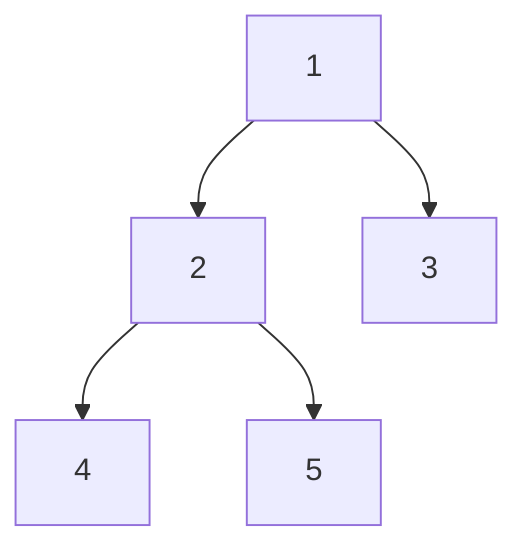

# 🌳 트리(Tree) 자료구조 & 알고리즘 완전 정복 — 코딩테스트 대비 노트

앞서 정리한 탐색 알고리즘 노트에 이어, 트리 관련 자료구조/알고리즘을 기본 → 중간 → 심화 순으로 정리했습니다.
각 항목은 **원리 / 시각 자료 / 시간복잡도 / JS 코드 / 코딩테스트 활용 팁** 순으로 구성했습니다.

---

## 목차

| 단계 | 주제 |
|---|---|
| 기본 | 1. 트리의 기본 개념과 순회 (전위/중위/후위/레벨) |
| 기본 | 2. 이진 탐색 트리 (BST) — 삽입/탐색/삭제 |
| 중간 | 3. 트리의 높이와 균형 판별 |
| 중간 | 4. 최소 공통 조상 (LCA) — 기본 버전 |
| 중간 | 5. 트라이 (Trie) |
| 심화 | 6. AVL 트리 (자가 균형 이진 탐색 트리) |
| 심화 | 7. 세그먼트 트리 (Segment Tree) |
| 심화 | 8. 펜윅 트리 / 구간 합 트리 (Fenwick Tree, BIT) |
| 심화 | 9. LCA — 희소 테이블(Binary Lifting) |

---

# 🟢 기본 단계

## 1. 트리의 기본 개념과 순회

### 원리
트리는 노드(Node)들이 부모-자식 관계로 연결된 **비선형 자료구조**입니다. 사이클이 없고, 루트(root)에서 모든 노드로 가는 경로가 유일합니다.

**순회(Traversal)** 는 트리의 모든 노드를 특정 순서로 방문하는 방법입니다.

- **전위 순회 (Pre-order)**: 노드 → 왼쪽 → 오른쪽
- **중위 순회 (In-order)**: 왼쪽 → 노드 → 오른쪽 (BST에서는 정렬된 순서가 됨!)
- **후위 순회 (Post-order)**: 왼쪽 → 오른쪽 → 노드
- **레벨 순회 (Level-order)**: 위에서 아래로, 같은 레벨은 좌→우 (BFS와 동일한 방식)

### 시각 자료
```
        1
       / \
      2   3
     / \
    4   5

전위(Pre-order):  1 → 2 → 4 → 5 → 3
중위(In-order):   4 → 2 → 5 → 1 → 3
후위(Post-order): 4 → 5 → 2 → 3 → 1
레벨(Level-order): 1 → 2 → 3 → 4 → 5
```



### 시간복잡도
- 모든 순회: O(n) (노드를 정확히 한 번씩 방문)

### JavaScript 코드
```javascript
class TreeNode {
  constructor(value) {
    this.value = value;
    this.left = null;
    this.right = null;
  }
}

// 전위 순회
function preOrder(node, result = []) {
  if (!node) return result;
  result.push(node.value);
  preOrder(node.left, result);
  preOrder(node.right, result);
  return result;
}

// 중위 순회
function inOrder(node, result = []) {
  if (!node) return result;
  inOrder(node.left, result);
  result.push(node.value);
  inOrder(node.right, result);
  return result;
}

// 후위 순회
function postOrder(node, result = []) {
  if (!node) return result;
  postOrder(node.left, result);
  postOrder(node.right, result);
  result.push(node.value);
  return result;
}

// 레벨 순회 (BFS)
function levelOrder(root) {
  if (!root) return [];
  const result = [];
  const queue = [root];
  let head = 0;

  while (head < queue.length) {
    const node = queue[head++];
    result.push(node.value);
    if (node.left) queue.push(node.left);
    if (node.right) queue.push(node.right);
  }
  return result;
}

// 예시 트리 구성
const root = new TreeNode(1);
root.left = new TreeNode(2);
root.right = new TreeNode(3);
root.left.left = new TreeNode(4);
root.left.right = new TreeNode(5);

console.log(preOrder(root));   // [1, 2, 4, 5, 3]
console.log(inOrder(root));    // [4, 2, 5, 1, 3]
console.log(postOrder(root));  // [4, 5, 2, 3, 1]
console.log(levelOrder(root)); // [1, 2, 3, 4, 5]
```

### 코딩테스트 팁
- 재귀 대신 반복문 + 스택으로도 구현할 수 있습니다. 재귀 깊이가 매우 깊어질 수 있는 문제(노드 수만 개)에서는 반복문 버전을 준비해두는 게 안전합니다.
- 후위 순회는 "자식을 먼저 처리해야 하는" 문제(트리 삭제, 폴더 크기 계산 등)에 자연스럽게 쓰입니다.

---

## 2. 이진 탐색 트리 (BST, Binary Search Tree)

### 원리
**왼쪽 서브트리는 모두 현재 노드보다 작고, 오른쪽 서브트리는 모두 현재 노드보다 크다**는 규칙을 가진 이진 트리입니다.
이 규칙 덕분에 탐색/삽입/삭제를 O(log n)에 할 수 있습니다 (트리가 균형 잡혀 있을 때).

### 시각 자료
```
탐색 대상: 7

        5
       / \
      3   8
     / \  / \
    1  4 7  9

5 → 7보다 작음 → 오른쪽(8)으로
8 → 7보다 큼   → 왼쪽(7)으로
7 = 7 ✅ found
```

### 시간복잡도
- 균형 잡힌 트리: O(log n)
- **최악의 경우(한쪽으로만 치우친 트리, 즉 연결리스트처럼 됨): O(n)** ← 심화 단계의 AVL 트리가 이 문제를 해결

### JavaScript 코드
```javascript
class BSTNode {
  constructor(value) {
    this.value = value;
    this.left = null;
    this.right = null;
  }
}

class BST {
  constructor() {
    this.root = null;
  }

  insert(value) {
    this.root = this._insertNode(this.root, value);
  }

  _insertNode(node, value) {
    if (!node) return new BSTNode(value);
    if (value < node.value) node.left = this._insertNode(node.left, value);
    else if (value > node.value) node.right = this._insertNode(node.right, value);
    // 값이 같으면 삽입하지 않음 (중복 허용 안 함)
    return node;
  }

  search(value) {
    return this._searchNode(this.root, value);
  }

  _searchNode(node, value) {
    if (!node) return false;
    if (value === node.value) return true;
    return value < node.value
      ? this._searchNode(node.left, value)
      : this._searchNode(node.right, value);
  }

  delete(value) {
    this.root = this._deleteNode(this.root, value);
  }

  _deleteNode(node, value) {
    if (!node) return null;

    if (value < node.value) {
      node.left = this._deleteNode(node.left, value);
    } else if (value > node.value) {
      node.right = this._deleteNode(node.right, value);
    } else {
      // 찾은 경우: 3가지 케이스
      if (!node.left) return node.right;       // 자식 0~1개
      if (!node.right) return node.left;

      // 자식 2개: 오른쪽 서브트리의 최소값(다음 순서 값)으로 교체
      let successor = node.right;
      while (successor.left) successor = successor.left;
      node.value = successor.value;
      node.right = this._deleteNode(node.right, successor.value);
    }
    return node;
  }
}

const bst = new BST();
[5, 3, 8, 1, 4, 7, 9].forEach((v) => bst.insert(v));
console.log(bst.search(7)); // true
console.log(bst.search(6)); // false
bst.delete(3);
console.log(bst.search(3)); // false
```

### 코딩테스트 팁
- BST의 중위 순회 결과는 항상 정렬된 배열이 됩니다 → "BST 검증" 문제에 활용.
- 정렬된 배열이 입력으로 들어오면 순서대로 삽입 시 최악의 경우(편향 트리)가 되므로 주의. 이 문제는 AVL/레드-블랙 트리로 해결합니다.

---

# 🟡 중간 단계

## 3. 트리의 높이와 균형 판별

### 원리
- **높이(Height)**: 루트에서 가장 먼 리프 노드까지의 거리
- **균형 트리(Balanced Tree)**: 모든 노드에서 왼쪽/오른쪽 서브트리의 높이 차이가 1 이하인 트리

균형이 깨진 트리는 탐색 성능이 O(n)까지 나빠질 수 있어, "균형 판별"은 트리 문제의 기본 소양입니다.

### 시각 자료
```
균형 트리 (O)          불균형 트리 (X)
      1                     1
     / \                     \
    2   3                     2
   /                           \
  4                             3
                                  \
높이 차이: |2-1| = 1 ≤ 1          4
→ 균형                     한쪽으로 치우침 → 불균형
```

### 시간복잡도
- O(n) — 모든 노드를 한 번씩 방문

### JavaScript 코드
```javascript
function getHeight(node) {
  if (!node) return -1; // 빈 트리의 높이는 -1 (노드 하나면 높이 0)
  return 1 + Math.max(getHeight(node.left), getHeight(node.right));
}

// 균형 판별 (하나의 순회로 O(n)에 처리하는 최적화 버전)
function isBalanced(root) {
  function check(node) {
    if (!node) return 0; // 높이 반환용 (여기선 노드 수 기준 0)

    const leftHeight = check(node.left);
    if (leftHeight === -1) return -1; // 이미 불균형 발견 → 조기 종료

    const rightHeight = check(node.right);
    if (rightHeight === -1) return -1;

    if (Math.abs(leftHeight - rightHeight) > 1) return -1; // 불균형!

    return 1 + Math.max(leftHeight, rightHeight);
  }

  return check(root) !== -1;
}

console.log(getHeight(root)); // 예시 트리 기준 2
console.log(isBalanced(root)); // true
```

### 코딩테스트 팁
- 매 노드마다 `getHeight`를 따로 호출하면 O(n²)이 됩니다. 위처럼 **높이 계산과 균형 판별을 동시에** 하나의 순회로 처리하면 O(n)으로 최적화됩니다. (코딩테스트에서 자주 나오는 최적화 포인트!)

---

## 4. 최소 공통 조상 (LCA, Lowest Common Ancestor) — 기본 버전

### 원리
두 노드의 **가장 가까운 공통 조상**을 찾는 문제입니다.
일반 이진 트리에서는 재귀적으로 "왼쪽/오른쪽 서브트리에 각각 타겟이 있는지"를 확인하며 찾습니다.

### 시각 자료
```
        3
       / \
      5   1
     / \ / \
    6  2 0  8
      / \
     7   4

LCA(6, 4) = 5   (6은 5의 왼쪽 자식, 4는 5의 오른쪽 자식 아래)
LCA(6, 8) = 3   (완전히 다른 갈래이므로 루트 근처에서 만남)
```

### 시간복잡도
- O(n) — 최악의 경우 모든 노드 방문

### JavaScript 코드
```javascript
function lowestCommonAncestor(root, p, q) {
  if (!root || root.value === p || root.value === q) return root;

  const left = lowestCommonAncestor(root.left, p, q);
  const right = lowestCommonAncestor(root.right, p, q);

  if (left && right) return root; // 양쪽에서 각각 찾음 → 현재 노드가 LCA
  return left ? left : right;     // 한쪽에서만 찾음 → 그 결과가 LCA
}

// BST라면 더 빠르게 (비교만으로 방향 결정, O(log n) 평균)
function lcaBST(root, p, q) {
  let node = root;
  while (node) {
    if (p < node.value && q < node.value) node = node.left;
    else if (p > node.value && q > node.value) node = node.right;
    else return node; // 여기서 나뉘는 지점이 LCA
  }
  return null;
}
```

### 코딩테스트 팁
- "일반 이진 트리"와 "이진 탐색 트리(BST)"는 LCA 찾는 방식이 다릅니다. 문제에서 BST임이 보장되면 훨씬 간단한 방법(비교만으로 방향 결정)을 쓸 수 있습니다.
- 쿼리(질문)가 매우 많이 들어오는 문제라면 심화 단계의 **희소 테이블(Binary Lifting)** 방식이 필요합니다.

---

## 5. 트라이 (Trie, Prefix Tree)

### 원리
문자열을 **문자 단위로 트리 형태**로 저장하는 자료구조입니다. 같은 접두사(prefix)를 공유하는 문자열들이 트리의 경로를 공유하게 됩니다.
"자동완성", "특정 접두사로 시작하는 단어 찾기" 문제에 최적화되어 있습니다.

### 시각 자료
```
저장된 단어: "cat", "car", "card", "dog"

           (root)
           /    \
          c      d
          |      |
          a      o
         / \     |
        t   r    g*
        *   |
            d
            *

* 표시는 "여기서 단어가 끝난다"는 의미
"ca"까지는 공유되고, 그 이후로 갈라짐 → 메모리 절약 + 빠른 접두사 탐색
```

### 시간복잡도
- 삽입/탐색: O(L) (L: 문자열 길이, 전체 데이터 개수와 무관!)

### JavaScript 코드
```javascript
class TrieNode {
  constructor() {
    this.children = {};
    this.isEndOfWord = false;
  }
}

class Trie {
  constructor() {
    this.root = new TrieNode();
  }

  insert(word) {
    let node = this.root;
    for (const char of word) {
      if (!node.children[char]) {
        node.children[char] = new TrieNode();
      }
      node = node.children[char];
    }
    node.isEndOfWord = true;
  }

  search(word) {
    const node = this._traverse(word);
    return node !== null && node.isEndOfWord;
  }

  startsWith(prefix) {
    return this._traverse(prefix) !== null;
  }

  _traverse(str) {
    let node = this.root;
    for (const char of str) {
      if (!node.children[char]) return null;
      node = node.children[char];
    }
    return node;
  }
}

const trie = new Trie();
["cat", "car", "card", "dog"].forEach((w) => trie.insert(w));

console.log(trie.search("car"));       // true
console.log(trie.search("ca"));        // false (끝나는 지점이 아님)
console.log(trie.startsWith("ca"));    // true (접두사로는 존재)
console.log(trie.startsWith("do"));    // true
console.log(trie.search("dog"));       // true
```

### 코딩테스트 팁
- "단어 검색", "자동완성", "가장 긴 공통 접두사" 유형 문제의 정답 자료구조입니다.
- 해시셋(Set)으로도 단어 존재 여부는 확인할 수 있지만, **접두사 검색**은 트라이가 압도적으로 유리합니다.

---

# 🔴 심화 단계

## 6. AVL 트리 (자가 균형 이진 탐색 트리)

### 원리
BST는 데이터가 정렬된 순서로 들어오면 한쪽으로 치우쳐 O(n)까지 느려질 수 있습니다.
AVL 트리는 삽입/삭제마다 **왼쪽/오른쪽 높이 차이(균형 인수, Balance Factor)를 -1~1로 유지**하도록 회전(rotation)을 수행해 항상 O(log n)을 보장합니다.

### 시각 자료 (오른쪽으로 치우쳐 회전이 필요한 경우 — LL 회전)
```
불균형 발생:        회전 후 (균형 회복):

    1                      2
     \                    / \
      2         →        1   3
       \
        3

y = 2 (불균형 지점), x = 1
"y를 x의 자식으로, x를 새로운 루트로" → 오른쪽 회전(Right Rotation)
```

### 4가지 회전 케이스
| 케이스 | 상황 | 해결 |
|---|---|---|
| LL | 왼쪽-왼쪽으로 치우침 | 오른쪽 회전 1번 |
| RR | 오른쪽-오른쪽으로 치우침 | 왼쪽 회전 1번 |
| LR | 왼쪽-오른쪽으로 치우침 | 왼쪽 회전 후 오른쪽 회전 |
| RL | 오른쪽-왼쪽으로 치우침 | 오른쪽 회전 후 왼쪽 회전 |

### 시간복잡도
- 탐색/삽입/삭제 모두 항상 O(log n) 보장

### JavaScript 코드
```javascript
class AVLNode {
  constructor(value) {
    this.value = value;
    this.left = null;
    this.right = null;
    this.height = 1;
  }
}

class AVLTree {
  getHeight(node) {
    return node ? node.height : 0;
  }

  getBalance(node) {
    return node ? this.getHeight(node.left) - this.getHeight(node.right) : 0;
  }

  rightRotate(y) {
    const x = y.left;
    const T2 = x.right;

    x.right = y;
    y.left = T2;

    y.height = 1 + Math.max(this.getHeight(y.left), this.getHeight(y.right));
    x.height = 1 + Math.max(this.getHeight(x.left), this.getHeight(x.right));

    return x; // 새로운 서브트리의 루트
  }

  leftRotate(x) {
    const y = x.right;
    const T2 = y.left;

    y.left = x;
    x.right = T2;

    x.height = 1 + Math.max(this.getHeight(x.left), this.getHeight(x.right));
    y.height = 1 + Math.max(this.getHeight(y.left), this.getHeight(y.right));

    return y;
  }

  insert(node, value) {
    if (!node) return new AVLNode(value);

    if (value < node.value) node.left = this.insert(node.left, value);
    else if (value > node.value) node.right = this.insert(node.right, value);
    else return node; // 중복 값은 무시

    node.height = 1 + Math.max(this.getHeight(node.left), this.getHeight(node.right));

    const balance = this.getBalance(node);

    // LL
    if (balance > 1 && value < node.left.value) return this.rightRotate(node);
    // RR
    if (balance < -1 && value > node.right.value) return this.leftRotate(node);
    // LR
    if (balance > 1 && value > node.left.value) {
      node.left = this.leftRotate(node.left);
      return this.rightRotate(node);
    }
    // RL
    if (balance < -1 && value < node.right.value) {
      node.right = this.rightRotate(node.right);
      return this.leftRotate(node);
    }

    return node;
  }
}

const avl = new AVLTree();
let avlRoot = null;
[1, 2, 3, 4, 5, 6, 7].forEach((v) => {
  avlRoot = avl.insert(avlRoot, v); // 정렬된 순서로 삽입해도 균형 유지!
});
console.log(avl.getHeight(avlRoot)); // 3 (일반 BST였다면 7이 됐을 것)
```

### 코딩테스트 팁
- 실무/시험에서 AVL 트리를 완전히 처음부터 구현하라는 요구는 드물지만, **"왜 균형이 중요한지", "회전의 원리"** 는 개념 문제로 자주 나옵니다.
- JS의 `Map`/`Set`은 내부적으로 해시 테이블이라 AVL과는 다르지만, 정렬된 순서를 유지하며 빠른 탐색이 필요할 때 AVL/레드-블랙 트리 개념이 활용됩니다.

---

## 7. 세그먼트 트리 (Segment Tree)

### 원리
배열의 **구간(range) 합/최소/최대**를 빠르게 구하고, 값 변경도 빠르게 처리할 수 있는 트리입니다.
각 노드가 배열의 특정 구간 정보를 저장하며, 이진 트리 형태로 구간을 절반씩 나눠 표현합니다.

### 시각 자료
```
배열: [1, 3, 5, 7, 9, 11]

                [0-5]=36
               /         \
          [0-2]=9      [3-5]=27
          /    \        /    \
      [0-1]=4 [2]=5 [3-4]=16 [5]=11
      /   \           /   \
   [0]=1 [1]=3     [3]=7 [4]=9

구간 합 쿼리(1~4): [0-2] 일부 + [3-4] 조합으로 O(log n)에 계산
```

### 시간복잡도
- 구간 쿼리 / 값 갱신: O(log n)
- (배열 순회로 매번 구간 합을 구하면 O(n)이 걸리므로, 쿼리가 많을 때 세그먼트 트리가 압도적으로 유리)

### JavaScript 코드 (구간 합 세그먼트 트리)
```javascript
class SegmentTree {
  constructor(arr) {
    this.n = arr.length;
    this.tree = new Array(2 * this.n);
    this._build(arr);
  }

  _build(arr) {
    // 리프 노드 채우기
    for (let i = 0; i < this.n; i++) {
      this.tree[this.n + i] = arr[i];
    }
    // 내부 노드는 자식 두 개의 합
    for (let i = this.n - 1; i > 0; i--) {
      this.tree[i] = this.tree[2 * i] + this.tree[2 * i + 1];
    }
  }

  // 인덱스 i의 값을 value로 갱신
  update(i, value) {
    let pos = i + this.n;
    this.tree[pos] = value;
    while (pos > 1) {
      pos = Math.floor(pos / 2);
      this.tree[pos] = this.tree[2 * pos] + this.tree[2 * pos + 1];
    }
  }

  // [l, r) 구간의 합 (l 포함, r 미포함)
  query(l, r) {
    let result = 0;
    l += this.n;
    r += this.n;
    while (l < r) {
      if (l % 2 === 1) result += this.tree[l++];
      if (r % 2 === 1) result += this.tree[--r];
      l = Math.floor(l / 2);
      r = Math.floor(r / 2);
    }
    return result;
  }
}

const seg = new SegmentTree([1, 3, 5, 7, 9, 11]);
console.log(seg.query(1, 5)); // 3+5+7+9 = 24
seg.update(2, 100);           // 인덱스 2의 값을 5→100으로 변경
console.log(seg.query(1, 5)); // 3+100+7+9 = 119
```

### 코딩테스트 팁
- "구간 합/최소/최대를 여러 번 물어보면서 값도 여러 번 바뀌는" 문제는 세그먼트 트리가 정답 신호입니다.
- 값 변경이 없고 구간 쿼리만 있다면 더 간단한 **누적합(Prefix Sum)** 으로 충분한 경우가 많으니, 문제에 "업데이트"가 있는지 먼저 확인하세요.

---

## 8. 펜윅 트리 / 구간 합 트리 (Fenwick Tree, Binary Indexed Tree)

### 원리
세그먼트 트리와 비슷한 역할(구간 합 + 값 갱신)을 하지만, **비트 연산을 이용해 훨씬 적은 메모리와 더 간결한 코드**로 구현할 수 있는 자료구조입니다.
핵심 아이디어: 각 인덱스는 "자신이 담당하는 구간의 크기"를 **인덱스의 마지막 1비트**로 결정합니다.

### 시각 자료
```
인덱스(1-based):  1    2    3    4    5    6    7    8
담당 구간 크기:    1    2    1    4    1    2    1    8

값 갱신 시 (index += index & (-index)):
  index=3 → 갱신할 다음 인덱스 = 3 + (3 & -3) = 3 + 1 = 4

구간 합 조회 시 (index -= index & (-index)):
  index=7 → 다음으로 더할 인덱스 = 7 - (7 & -7) = 7 - 1 = 6
```

### 시간복잡도
- 갱신 / 구간 합 조회: O(log n)
- 세그먼트 트리보다 구현이 짧고 메모리도 적게 씀 (배열 하나로 충분)

### JavaScript 코드
```javascript
class FenwickTree {
  constructor(n) {
    this.n = n;
    this.tree = new Array(n + 1).fill(0); // 1-based indexing
  }

  // index(1-based)에 value를 더함
  update(index, value) {
    for (; index <= this.n; index += index & (-index)) {
      this.tree[index] += value;
    }
  }

  // 1부터 index까지의 누적 합
  prefixSum(index) {
    let sum = 0;
    for (; index > 0; index -= index & (-index)) {
      sum += this.tree[index];
    }
    return sum;
  }

  // [left, right] 구간 합 (1-based, 양 끝 포함)
  rangeSum(left, right) {
    return this.prefixSum(right) - this.prefixSum(left - 1);
  }
}

const fenwick = new FenwickTree(6);
[1, 3, 5, 7, 9, 11].forEach((v, i) => fenwick.update(i + 1, v)); // 1-based로 삽입

console.log(fenwick.rangeSum(2, 5)); // 3+5+7+9 = 24
fenwick.update(3, 95); // 인덱스 3의 값에 95를 더함 (5 → 100)
console.log(fenwick.rangeSum(2, 5)); // 3+100+7+9 = 119
```

### 세그먼트 트리 vs 펜윅 트리

| 구분 | 세그먼트 트리 | 펜윅 트리 |
|---|---|---|
| 구현 난이도 | 다소 복잡 | 간결함 |
| 메모리 | 배열 2배 크기 | 배열 1배 크기 |
| 기능 확장성 | 최소/최대/GCD 등 다양하게 확장 쉬움 | 주로 합(sum) 연산에 최적화 |
| 구간 갱신 | 상대적으로 자연스러움 | 추가 기법(차이 배열) 필요 |

### 코딩테스트 팁
- 구간 합 + 갱신만 필요하다면 코드가 짧은 펜윅 트리가 실전에서 더 선호됩니다.
- 최소/최대값처럼 "역연산이 없는" 쿼리가 필요하면 세그먼트 트리를 사용하세요.

---

## 9. 최소 공통 조상 (LCA) — 희소 테이블 (Binary Lifting)

### 원리
LCA 쿼리가 **아주 많이** 들어오는 경우, 매번 O(n)으로 찾으면 너무 느립니다.
**"2의 거듭제곱만큼 조상을 미리 계산해두는"** 희소 테이블(Sparse Table)을 이용하면 쿼리당 O(log n)으로 줄일 수 있습니다.

`up[k][v]` = 노드 v로부터 2^k번째 조상

### 시각 자료
```
트리의 깊이가 8일 때, 노드 v의 조상을 찾아가는 과정:
"조상으로 5칸 올라가야 한다" → 5 = 4 + 1 (이진수로 101)

  up[2][v] (4칸 위로) → 그 다음 up[0][...] (1칸 위로)

한 칸씩 5번 올라가는 대신, "미리 계산된 큰 점프"를 조합해서
O(log n)만에 원하는 조상에 도달합니다.
```

### 시간복잡도
- 전처리: O(n log n)
- 쿼리(LCA 계산)당: O(log n)

### JavaScript 코드
```javascript
class LCASolver {
  constructor(n, adjList, root = 0) {
    this.n = n;
    this.LOG = Math.ceil(Math.log2(n)) + 1;
    this.depth = new Array(n).fill(0);
    this.up = Array.from({ length: this.LOG }, () => new Array(n).fill(-1));

    this._dfs(root, -1, adjList);
    this._buildSparseTable();
  }

  _dfs(node, parent, adjList) {
    // 반복문 기반 DFS (재귀 스택 오버플로우 방지)
    const stack = [[node, parent]];
    while (stack.length > 0) {
      const [cur, par] = stack.pop();
      this.up[0][cur] = par;
      for (const next of adjList[cur]) {
        if (next !== par) {
          this.depth[next] = this.depth[cur] + 1;
          stack.push([next, cur]);
        }
      }
    }
  }

  _buildSparseTable() {
    for (let k = 1; k < this.LOG; k++) {
      for (let v = 0; v < this.n; v++) {
        const mid = this.up[k - 1][v];
        this.up[k][v] = mid === -1 ? -1 : this.up[k - 1][mid];
      }
    }
  }

  lca(u, v) {
    if (this.depth[u] < this.depth[v]) [u, v] = [v, u]; // u가 더 깊게

    let diff = this.depth[u] - this.depth[v];
    for (let k = 0; k < this.LOG; k++) {
      if ((diff >> k) & 1) u = this.up[k][u]; // 깊이 차이만큼 u를 올림
    }

    if (u === v) return u;

    for (let k = this.LOG - 1; k >= 0; k--) {
      if (this.up[k][u] !== -1 && this.up[k][u] !== this.up[k][v]) {
        u = this.up[k][u];
        v = this.up[k][v];
      }
    }
    return this.up[0][u]; // 마지막으로 만나는 공통 부모
  }
}

// 트리 예시 (0번을 루트로): 0-1, 0-2, 1-3, 1-4
const adjList = { 0: [1, 2], 1: [0, 3, 4], 2: [0], 3: [1], 4: [1] };
const solver = new LCASolver(5, adjList, 0);

console.log(solver.lca(3, 4)); // 1
console.log(solver.lca(3, 2)); // 0
```

### 코딩테스트 팁
- LCA 쿼리가 1번뿐이면 굳이 희소 테이블을 만들 필요 없이 "기본 버전(중간 단계 4번)"으로 충분합니다.
- 쿼리가 수천~수만 번 반복되는 문제(트리 경로 문제, 최소 신장 트리 이후 처리 등)에서 희소 테이블 방식이 필요합니다.

---

## 📌 전체 요약 표

| 주제 | 시간복잡도 | 주요 활용 |
|---|---|---|
| 트리 순회 | O(n) | 트리 전체 순회, 정렬(중위) |
| BST | O(log n)~O(n) | 정렬 유지 탐색/삽입/삭제 |
| 높이/균형 판별 | O(n) | 균형 트리 검증 |
| LCA (기본) | O(n) | 두 노드의 공통 조상 (쿼리 적을 때) |
| 트라이 | O(L) | 자동완성, 접두사 탐색 |
| AVL 트리 | O(log n) 보장 | 항상 균형 잡힌 탐색 구조 |
| 세그먼트 트리 | O(log n) | 구간 합/최소/최대 + 값 갱신 |
| 펜윅 트리 | O(log n) | 구간 합 + 값 갱신 (더 간결) |
| LCA (희소 테이블) | O(n log n) 전처리, O(log n) 쿼리 | LCA 쿼리 다수 |

## 🎯 학습 순서 추천
1. 기본 단계(순회, BST)는 재귀 구조에 익숙해지는 게 핵심입니다. "왼쪽 → 자신 → 오른쪽" 같은 순서를 손으로 직접 그려보며 익히세요.
2. 중간 단계는 "트리 문제에서 자주 나오는 하위 문제"들입니다. 특히 트라이는 문자열 문제에서 자주 등장하니 꼭 익혀두세요.
3. 심화 단계(세그먼트/펜윅/AVL/희소테이블)는 문제에서 **"구간 쿼리가 몇 번이나 반복되는지", "값이 자주 바뀌는지"** 를 먼저 파악한 뒤 어떤 자료구조가 필요한지 판단하는 연습이 중요합니다. 코드를 외우기보다 "언제 써야 하는지"를 우선 익히세요.
